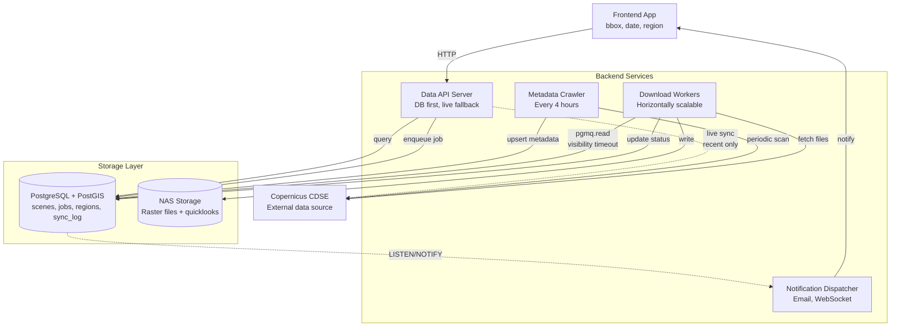
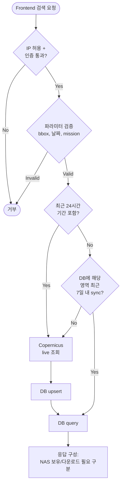
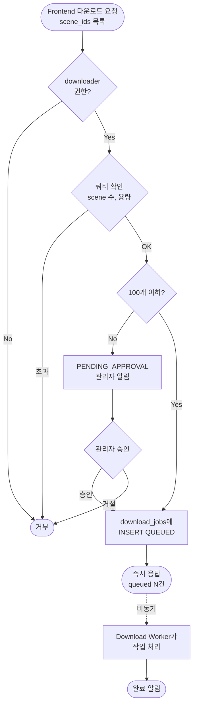

# 01. 아키텍처 개요

## 전체 구조

시스템은 3개의 **NestJS 애플리케이션**으로 구성된다. 모두 공통 `libs/`를 공유하지만 독립적으로 배포된다.



## 컴포넌트 책임

### Data API Server (`apps/api`)

- NestJS HTTP 애플리케이션
- 프론트 요청 수신 (검색, 다운로드 요청, 상태 조회)
- DB 우선 조회, 필요 시 Copernicus 라이브 호출
- 권한 검증, 쿼터 체크 (Guards + Interceptors)
- 다운로드 요청을 `download_jobs` 테이블에 INSERT
- **핵심: 파일 다운로드 자체는 하지 않음**

### Metadata Crawler (`apps/crawler`)

- NestJS 애플리케이션 + `@nestjs/schedule` (Cron 데코레이터)
- 4시간 주기로 정의된 AOI(한반도 등) 메타데이터 수집
- Copernicus API 호출 → DB upsert
- **파일은 받지 않음, 메타데이터만**
- 가벼운 작업, 단일 인스턴스로 충분

### Download Worker (`apps/worker`)

- NestJS 애플리케이션 (HTTP 서버 없이 `NestFactory.createApplicationContext`)
- `pgmq.download_queue`에서 `pgmq.read()`로 pull (visibility timeout)
- `download_jobs` 상태 테이블에 진행률/에러/완료 시각 기록
- Copernicus에서 파일 다운로드 → NAS 저장
- DB의 `sentinel_scenes.nas_path` 업데이트
- 완료/실패 시 `notifications` 테이블에 기록
- **수평 확장 가능**: 여러 인스턴스 병렬 실행

### Notification Dispatcher

- Worker 내 모듈 또는 별도 앱으로 분리 가능
- PostgreSQL `LISTEN/NOTIFY`로 완료 이벤트 수신 (`pg` 드라이버 직접 사용)
- 이메일(`@nestjs-modules/mailer`), WebSocket(`@nestjs/websockets`), Slack 등으로 전달
- 실패 알림도 처리

## 검색 요청 흐름



## 다운로드 요청 흐름



## 서버 분리 근거

동일 컴포넌트에 섞여 있으면 안 되는 이유:

- **API 서버**: 응답 시간 민감 (< 1초). CPU 낮음, I/O 낮음
- **Download Worker**: 장시간 IO-bound (scene당 수분). 대역폭 소비 큼
- **Metadata Crawler**: 주기적 배치. Copernicus API 의존성 높음

스케일링 특성이 완전히 다르므로 별도 프로세스(같은 서버든 다른 서버든)로 실행해야 한다.

## NestJS 프로젝트 레이아웃

NestJS CLI의 monorepo 모드로 구성한다 (`nest generate app`).

```
sentinel-platform/
├── apps/
│   ├── api/                    # Data API Server
│   │   ├── src/
│   │   │   ├── main.ts
│   │   │   ├── app.module.ts
│   │   │   ├── scenes/         # 검색 엔드포인트
│   │   │   ├── downloads/      # 다운로드 요청
│   │   │   ├── auth/           # 로그인, JWT
│   │   │   ├── admin/          # 관리자 API
│   │   │   └── regions/        # 행정구역
│   │   └── test/
│   ├── worker/                 # Download Worker
│   │   └── src/
│   │       ├── main.ts         # createApplicationContext
│   │       ├── worker.module.ts
│   │       └── download/       # 다운로드 처리
│   └── crawler/                # Metadata Crawler
│       └── src/
│           ├── main.ts
│           ├── crawler.module.ts
│           └── crawl/          # @Cron 데코레이터
├── libs/
│   ├── database/               # TypeORM 엔티티, 리포지토리
│   ├── copernicus/             # Copernicus API 클라이언트
│   ├── notifications/          # 알림 로직
│   └── common/                 # DTO, 예외, 유틸
├── nest-cli.json
├── tsconfig.json
├── package.json
└── docker-compose.yml
```

각 앱의 `main.ts`는 서로 다른 부트스트랩 패턴 사용:

```typescript
// apps/api/src/main.ts — 일반 HTTP 서버
async function bootstrap() {
  const app = await NestFactory.create(AppModule);
  app.useGlobalPipes(new ValidationPipe({ transform: true }));
  await app.listen(3000);
}

// apps/worker/src/main.ts — HTTP 없이 실행
async function bootstrap() {
  const app = await NestFactory.createApplicationContext(WorkerModule);
  const worker = app.get(DownloadWorkerService);
  await worker.run();
}

// apps/crawler/src/main.ts — 스케줄러 포함
async function bootstrap() {
  const app = await NestFactory.createApplicationContext(CrawlerModule);
  // @Cron 데코레이터가 자동으로 돌아감, 프로세스 유지만 필요
  await new Promise(() => {});
}
```

## 확장 고려사항

- **Download Worker는 N개 인스턴스**로 쉽게 수평 확장 가능. 큐가 조정해줌.
- **API 서버는 무상태**로 설계, 로드밸런서 뒤에 여러 인스턴스 가능.
- **Crawler는 단일 인스턴스** (중복 크롤링 방지). HA 필요 시 DB advisory lock으로 leader election 추가.
- **DB는 읽기 복제본** 추가해서 API 서버 조회 부하 분산 가능.
