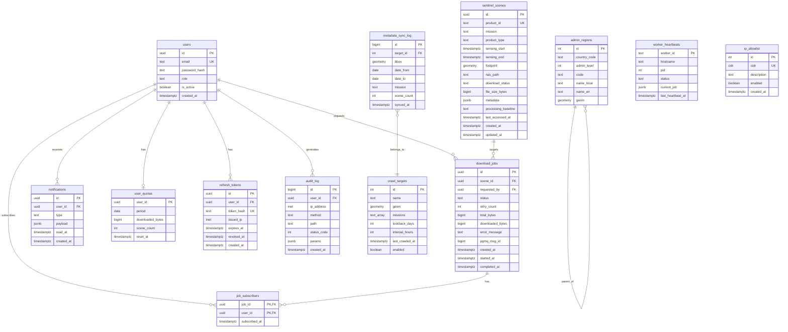
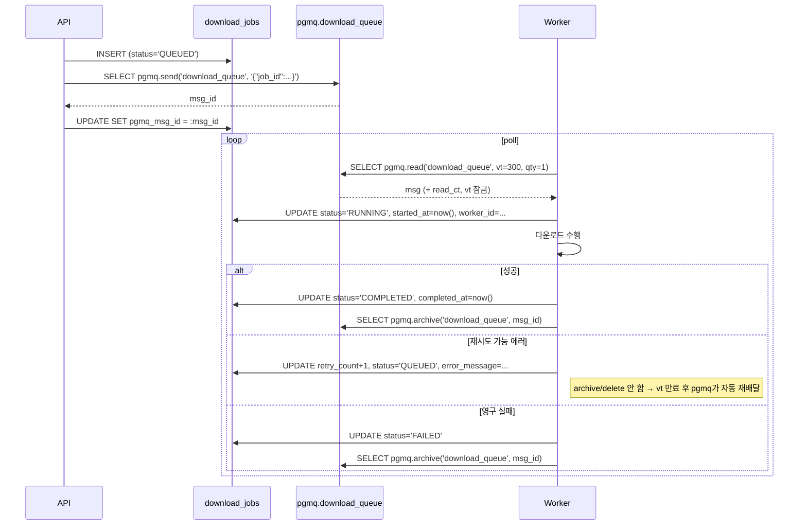

# 02. 데이터베이스 스키마

## 전제 조건

- PostgreSQL 15 이상
- PostGIS 3.3 이상
- pgmq 1.x 이상 (다운로드 잡 큐용)
- 모든 `geometry`는 **EPSG:4326** (WGS84 경위도)
- 타임존은 `UTC` 저장, 표시 시 변환

## 확장 및 초기 설정

```sql
CREATE EXTENSION IF NOT EXISTS postgis;
CREATE EXTENSION IF NOT EXISTS "uuid-ossp";
CREATE EXTENSION IF NOT EXISTS pgmq CASCADE;

SET timezone = 'UTC';

-- 다운로드 잡용 큐 생성 (한 번만 실행)
SELECT pgmq.create('download_queue');
```

> **pgmq 큐 vs `download_jobs` 테이블의 역할 분담**
>
> - **pgmq**: 워커가 실제로 pull 하는 "전송 채널". visibility timeout으로 중복 처리 방지, 재시도 가시성 제공
> - **`download_jobs`**: 비즈니스 상태 테이블. 승인 플로우(`PENDING_APPROVAL`), 사용자별 조회, 감사 추적, 진행률, 구독자 관계
> - 두 저장소는 `job_id`로 연결. API는 `download_jobs` INSERT 후 pgmq에 `{"job_id": "..."}` 메시지 발송. 워커는 pgmq에서 pull → `download_jobs` 업데이트 → pgmq archive.

## 테이블 ER 다이어그램



## 핵심 테이블 DDL

### `sentinel_scenes` — 위성 영상 메타데이터

```sql
CREATE TABLE sentinel_scenes (
    id UUID PRIMARY KEY DEFAULT uuid_generate_v4(),
    product_id TEXT NOT NULL UNIQUE,
    mission TEXT NOT NULL,
    product_type TEXT,
    sensing_start TIMESTAMPTZ NOT NULL,
    sensing_end TIMESTAMPTZ,
    footprint GEOMETRY(POLYGON, 4326) NOT NULL,
    nas_path TEXT,
    download_status TEXT NOT NULL DEFAULT 'NOT_DOWNLOADED',
    file_size_bytes BIGINT,
    processing_baseline TEXT,
    metadata JSONB NOT NULL DEFAULT '{}'::jsonb,
    last_accessed_at TIMESTAMPTZ,
    created_at TIMESTAMPTZ NOT NULL DEFAULT now(),
    updated_at TIMESTAMPTZ NOT NULL DEFAULT now(),
    CONSTRAINT chk_download_status CHECK (
        download_status IN ('NOT_DOWNLOADED', 'DOWNLOADING', 'READY', 'FAILED')
    )
);

CREATE INDEX idx_scenes_footprint ON sentinel_scenes USING GIST (footprint);
CREATE INDEX idx_scenes_sensing ON sentinel_scenes (sensing_start DESC);
CREATE INDEX idx_scenes_mission ON sentinel_scenes (mission, sensing_start DESC);
CREATE INDEX idx_scenes_status ON sentinel_scenes (download_status) WHERE download_status != 'READY';
CREATE INDEX idx_scenes_last_access ON sentinel_scenes (last_accessed_at)
    WHERE nas_path IS NOT NULL;
```

- `nas_path IS NULL` → 메타데이터만 존재, 파일 없음
- `download_status = 'READY'` → NAS에 파일 보유
- `metadata` JSONB에 Copernicus 원본 응답 통째로 저장
- `last_accessed_at` → 파일 서빙/다운로드 요청 시 갱신. 보관 정책([07-ops-policy.md](./07-ops-policy.md))에서 cleanup 판정에 사용

### `admin_regions` — 행정구역

```sql
CREATE TABLE admin_regions (
    id SERIAL PRIMARY KEY,
    country_code TEXT NOT NULL,
    admin_level INT NOT NULL,
    code TEXT,
    name_local TEXT NOT NULL,
    name_en TEXT,
    parent_id INT REFERENCES admin_regions(id),
    geom GEOMETRY(MULTIPOLYGON, 4326) NOT NULL,
    UNIQUE (country_code, admin_level, code)
);

CREATE INDEX idx_regions_geom ON admin_regions USING GIST (geom);
CREATE INDEX idx_regions_country_level ON admin_regions (country_code, admin_level);
CREATE INDEX idx_regions_name_local ON admin_regions USING GIN (to_tsvector('simple', name_local));
```

- `admin_level`: 0=국가, 1=시도, 2=시군구, 3=읍면동
- 초기에는 `country_code = 'KR'`만 적재

### `download_jobs` — 다운로드 잡 상태 테이블

> pgmq가 "현재 처리해야 할 작업 메시지 채널"을 맡고, 이 테이블은 **영속 상태**(승인, 사용자 조회, 진행률, 감사)를 맡는다.

```sql
CREATE TABLE download_jobs (
    id UUID PRIMARY KEY DEFAULT uuid_generate_v4(),
    scene_id UUID NOT NULL REFERENCES sentinel_scenes(id),
    requested_by UUID NOT NULL REFERENCES users(id),
    status TEXT NOT NULL DEFAULT 'QUEUED',
    retry_count INT NOT NULL DEFAULT 0,
    total_bytes BIGINT,
    downloaded_bytes BIGINT NOT NULL DEFAULT 0,
    error_message TEXT,
    pgmq_msg_id BIGINT,           -- 현재 pgmq 메시지 id (재시도 시 갱신)
    worker_id TEXT,               -- 현재 처리 중인 워커 식별자
    created_at TIMESTAMPTZ NOT NULL DEFAULT now(),
    started_at TIMESTAMPTZ,
    completed_at TIMESTAMPTZ,
    CONSTRAINT chk_job_status CHECK (
        status IN ('QUEUED', 'PENDING_APPROVAL', 'RUNNING', 'COMPLETED', 'FAILED', 'REJECTED')
    )
);

-- 동일 scene에 "처리 중" 잡이 2개 이상 생기지 않도록
CREATE UNIQUE INDEX uq_jobs_scene_active
    ON download_jobs (scene_id)
    WHERE status IN ('QUEUED', 'PENDING_APPROVAL', 'RUNNING');

CREATE INDEX idx_jobs_status ON download_jobs (status, created_at)
    WHERE status IN ('QUEUED', 'RUNNING');
CREATE INDEX idx_jobs_user ON download_jobs (requested_by, created_at DESC);
CREATE INDEX idx_jobs_pgmq_msg ON download_jobs (pgmq_msg_id) WHERE pgmq_msg_id IS NOT NULL;
```

**주요 포인트**:
- `partial unique index`: `COMPLETED`/`FAILED`/`REJECTED`는 같은 scene에 여러 row 허용 (재시도 이력), 활성 상태만 유일
- `requested_by`: "최초 요청자". 이후 동일 scene을 요청한 사람은 `job_subscribers`에 추가
- `downloaded_bytes` / `total_bytes`: API가 `progress_percent`를 계산해 응답
- `pgmq_msg_id`: 워커가 pgmq에서 pull한 메시지 id를 저장해 archive/delete 시 참조

### `job_subscribers` — 동일 scene 중복 요청 통합

```sql
CREATE TABLE job_subscribers (
    job_id UUID NOT NULL REFERENCES download_jobs(id) ON DELETE CASCADE,
    user_id UUID NOT NULL REFERENCES users(id) ON DELETE CASCADE,
    subscribed_at TIMESTAMPTZ NOT NULL DEFAULT now(),
    PRIMARY KEY (job_id, user_id)
);

CREATE INDEX idx_subscribers_user ON job_subscribers (user_id);
```

**사용 패턴** — [04-download-workflow.md](./04-download-workflow.md)의 "동일 scene 중복 방지"에서 참조:

```sql
-- 1) 이미 활성 잡이 있는지 확인
SELECT id FROM download_jobs
WHERE scene_id = $1
  AND status IN ('QUEUED', 'PENDING_APPROVAL', 'RUNNING')
LIMIT 1;

-- 2) 있으면 구독만 추가
INSERT INTO job_subscribers (job_id, user_id)
VALUES ($1, $2)
ON CONFLICT DO NOTHING;
```

완료/실패 시 `download_jobs.requested_by` + 모든 구독자에게 알림 발송.

### pgmq 큐와의 연동 흐름



**pgmq를 선택한 이유**:
- `SKIP LOCKED` 수동 구현 대비 **visibility timeout**, **archive 테이블**, **read_ct**(읽은 횟수) 기본 제공
- 워커가 중간에 죽어도 `vt` 만료 후 메시지가 자동으로 가시화됨 → 별도 크래시 리커버리 로직 불필요
- `pgmq.archive()`가 원본 큐 테이블에서 archive 테이블로 옮겨줘 큐 테이블이 무한 증가하지 않음

### `metadata_sync_log` — 크롤링 이력

```sql
CREATE TABLE metadata_sync_log (
    id BIGSERIAL PRIMARY KEY,
    target_id INT REFERENCES crawl_targets(id),
    bbox GEOMETRY(POLYGON, 4326) NOT NULL,
    date_from DATE NOT NULL,
    date_to DATE NOT NULL,
    mission TEXT NOT NULL,
    scene_count INT NOT NULL DEFAULT 0,
    synced_at TIMESTAMPTZ NOT NULL DEFAULT now()
);

CREATE INDEX idx_sync_bbox ON metadata_sync_log USING GIST (bbox);
CREATE INDEX idx_sync_recent ON metadata_sync_log (mission, synced_at DESC);
```

- 캐시 히트 판정용: "이 bbox를 포함하는 영역을 최근에 sync했나?"

### `crawl_targets` — 크롤링 대상 AOI

```sql
CREATE TABLE crawl_targets (
    id SERIAL PRIMARY KEY,
    name TEXT NOT NULL,
    geom GEOMETRY(POLYGON, 4326) NOT NULL,
    missions TEXT[] NOT NULL DEFAULT ARRAY['S1A', 'S1C', 'S2A', 'S2B'],
    lookback_days INT NOT NULL DEFAULT 7,
    interval_hours INT NOT NULL DEFAULT 4,
    last_crawled_at TIMESTAMPTZ,
    enabled BOOLEAN NOT NULL DEFAULT true
);

INSERT INTO crawl_targets (name, geom, missions)
VALUES (
    'Korea Peninsula',
    ST_MakeEnvelope(124.0, 33.0, 132.0, 39.0, 4326),
    ARRAY['S1A', 'S1C', 'S2A', 'S2B']
);
```

### `users` 및 권한

```sql
CREATE TABLE users (
    id UUID PRIMARY KEY DEFAULT uuid_generate_v4(),
    email TEXT NOT NULL UNIQUE,
    password_hash TEXT NOT NULL,
    display_name TEXT,
    role TEXT NOT NULL DEFAULT 'viewer',
    is_active BOOLEAN NOT NULL DEFAULT false,
    created_at TIMESTAMPTZ NOT NULL DEFAULT now(),
    CONSTRAINT chk_user_role CHECK (role IN ('viewer', 'downloader', 'admin'))
);

CREATE TABLE user_quotas (
    user_id UUID NOT NULL REFERENCES users(id),
    period DATE NOT NULL,
    downloaded_bytes BIGINT NOT NULL DEFAULT 0,
    scene_count INT NOT NULL DEFAULT 0,
    reset_at TIMESTAMPTZ NOT NULL DEFAULT (date_trunc('day', now()) + interval '1 day'),
    PRIMARY KEY (user_id, period)
);

CREATE TABLE ip_allowlist (
    id SERIAL PRIMARY KEY,
    cidr CIDR NOT NULL UNIQUE,
    description TEXT,
    enabled BOOLEAN NOT NULL DEFAULT true,
    created_at TIMESTAMPTZ NOT NULL DEFAULT now()
);
```

### `refresh_tokens` — JWT 리프레시 토큰

재사용 감지(token rotation) 구현. 토큰 자체가 아니라 **SHA-256 해시**를 저장.

```sql
CREATE TABLE refresh_tokens (
    id UUID PRIMARY KEY DEFAULT uuid_generate_v4(),
    user_id UUID NOT NULL REFERENCES users(id) ON DELETE CASCADE,
    token_hash TEXT NOT NULL UNIQUE,
    issued_ip INET,
    user_agent TEXT,
    expires_at TIMESTAMPTZ NOT NULL,
    revoked_at TIMESTAMPTZ,
    replaced_by UUID REFERENCES refresh_tokens(id),
    created_at TIMESTAMPTZ NOT NULL DEFAULT now()
);

CREATE INDEX idx_refresh_user_active
    ON refresh_tokens (user_id)
    WHERE revoked_at IS NULL;
CREATE INDEX idx_refresh_expires ON refresh_tokens (expires_at);
```

- `replaced_by`: rotation 체인 추적. 이미 `replaced_by`가 있는 토큰이 다시 제출되면 **도난**으로 판단 → 해당 사용자의 모든 refresh 토큰 revoke
- 만료 토큰은 주기적으로 물리 삭제 (cleanup 잡에서 `WHERE expires_at < now() - interval '30 days'`)

### `audit_log` — API 감사 로그

```sql
CREATE TABLE audit_log (
    id BIGSERIAL PRIMARY KEY,
    user_id UUID REFERENCES users(id) ON DELETE SET NULL,
    ip_address INET,
    method TEXT NOT NULL,
    path TEXT NOT NULL,
    status_code INT,
    params JSONB,
    latency_ms INT,
    created_at TIMESTAMPTZ NOT NULL DEFAULT now()
);

CREATE INDEX idx_audit_user_time ON audit_log (user_id, created_at DESC);
CREATE INDEX idx_audit_time ON audit_log (created_at DESC);
CREATE INDEX idx_audit_path_status ON audit_log (path, status_code, created_at DESC);
```

- 최소 6개월 보관 ([06-auth.md](./06-auth.md) 참조)
- 파티셔닝 고려: row 수가 많아지면 `created_at` 월별 파티션으로 분할
- 민감 데이터(비밀번호 등)는 `params`에 저장 전 마스킹

### `worker_heartbeats` — 워커 상태 추적

```sql
CREATE TABLE worker_heartbeats (
    worker_id TEXT PRIMARY KEY,
    hostname TEXT NOT NULL,
    pid INT NOT NULL,
    status TEXT NOT NULL,
    current_job UUID REFERENCES download_jobs(id) ON DELETE SET NULL,
    last_heartbeat_at TIMESTAMPTZ NOT NULL DEFAULT now(),
    started_at TIMESTAMPTZ NOT NULL DEFAULT now(),
    CONSTRAINT chk_worker_status CHECK (
        status IN ('IDLE', 'BUSY', 'STOPPING')
    )
);

CREATE INDEX idx_heartbeats_stale ON worker_heartbeats (last_heartbeat_at);
```

- `worker_id`: 보통 `${hostname}-${pid}` 또는 UUID. 컨테이너 재시작 시 새 row
- 워커는 30초마다 `UPDATE worker_heartbeats SET last_heartbeat_at = now(), status = :s, current_job = :j WHERE worker_id = :id`
- `last_heartbeat_at < now() - interval '2 minutes'`인 워커는 죽은 것으로 간주 — 해당 워커의 RUNNING 잡은 pgmq의 `vt` 만료로 자동 재배달되므로 **별도 복구 로직 불필요**. 모니터링/알람 용도.

### `notifications`

```sql
CREATE TABLE notifications (
    id UUID PRIMARY KEY DEFAULT uuid_generate_v4(),
    user_id UUID NOT NULL REFERENCES users(id),
    type TEXT NOT NULL,
    payload JSONB NOT NULL,
    read_at TIMESTAMPTZ,
    created_at TIMESTAMPTZ NOT NULL DEFAULT now()
);

CREATE INDEX idx_notif_user_unread ON notifications (user_id, created_at DESC)
    WHERE read_at IS NULL;
```

Download Worker가 완료 시:

```sql
INSERT INTO notifications (user_id, type, payload)
VALUES ($1, 'download_completed', jsonb_build_object('scene_id', $2, 'nas_path', $3));
NOTIFY new_notification;
```

Dispatcher는 `LISTEN new_notification` 받아서 처리.

## Shapefile 적재

한국 행정구역 shapefile을 `admin_regions`에 넣을 때:

```bash
ogr2ogr -f "PostgreSQL" \
  PG:"host=localhost dbname=sentinel user=app" \
  ./korea_admin.shp \
  -nln admin_regions_staging \
  -t_srs EPSG:4326 \
  -lco GEOMETRY_NAME=geom \
  -lco ENCODING=UTF-8 \
  --config SHAPE_ENCODING CP949
```

이후 staging 테이블에서 본 테이블로 `INSERT ... SELECT`로 옮기며 `country_code`, `admin_level` 등을 채워 넣는다.

## TypeORM 엔티티 예시

`libs/database/src/entities/` 아래에 배치.

### `sentinel-scene.entity.ts`

```typescript
import {
  Entity,
  PrimaryGeneratedColumn,
  Column,
  Index,
  CreateDateColumn,
  UpdateDateColumn,
} from 'typeorm';
import { Polygon } from 'geojson';

export type DownloadStatus = 'NOT_DOWNLOADED' | 'DOWNLOADING' | 'READY' | 'FAILED';

@Entity('sentinel_scenes')
@Index('idx_scenes_footprint', { synchronize: false })
@Index('idx_scenes_sensing', ['sensingStart'])
@Index('idx_scenes_mission', ['mission', 'sensingStart'])
export class SentinelScene {
  @PrimaryGeneratedColumn('uuid')
  id: string;

  @Column({ name: 'product_id', unique: true })
  productId: string;

  @Column()
  mission: string;

  @Column({ name: 'product_type', nullable: true })
  productType: string;

  @Column({ name: 'sensing_start', type: 'timestamptz' })
  sensingStart: Date;

  @Column({ name: 'sensing_end', type: 'timestamptz', nullable: true })
  sensingEnd: Date;

  @Column({
    type: 'geometry',
    spatialFeatureType: 'Polygon',
    srid: 4326,
  })
  footprint: Polygon;

  @Column({ name: 'nas_path', nullable: true })
  nasPath: string;

  @Column({
    name: 'download_status',
    type: 'text',
    default: 'NOT_DOWNLOADED',
  })
  downloadStatus: DownloadStatus;

  @Column({ name: 'file_size_bytes', type: 'bigint', nullable: true })
  fileSizeBytes: number;

  @Column({ name: 'processing_baseline', nullable: true })
  processingBaseline: string;

  @Column({ type: 'jsonb', default: {} })
  metadata: Record<string, any>;

  @CreateDateColumn({ name: 'created_at', type: 'timestamptz' })
  createdAt: Date;

  @UpdateDateColumn({ name: 'updated_at', type: 'timestamptz' })
  updatedAt: Date;
}
```

### `admin-region.entity.ts`

```typescript
import {
  Entity,
  PrimaryGeneratedColumn,
  Column,
  ManyToOne,
  Index,
} from 'typeorm';
import { MultiPolygon } from 'geojson';

@Entity('admin_regions')
@Index('idx_regions_geom', { synchronize: false })
@Index('idx_regions_country_level', ['countryCode', 'adminLevel'])
export class AdminRegion {
  @PrimaryGeneratedColumn()
  id: number;

  @Column({ name: 'country_code' })
  countryCode: string;

  @Column({ name: 'admin_level', type: 'int' })
  adminLevel: number;

  @Column({ nullable: true })
  code: string;

  @Column({ name: 'name_local' })
  nameLocal: string;

  @Column({ name: 'name_en', nullable: true })
  nameEn: string;

  @ManyToOne(() => AdminRegion, { nullable: true })
  parent: AdminRegion;

  @Column({
    type: 'geometry',
    spatialFeatureType: 'MultiPolygon',
    srid: 4326,
  })
  geom: MultiPolygon;
}
```

### `download-job.entity.ts`

```typescript
import {
  Entity,
  PrimaryGeneratedColumn,
  Column,
  Index,
  CreateDateColumn,
} from 'typeorm';

export type JobStatus =
  | 'QUEUED'
  | 'PENDING_APPROVAL'
  | 'RUNNING'
  | 'COMPLETED'
  | 'FAILED'
  | 'REJECTED';

@Entity('download_jobs')
@Index('idx_jobs_status', ['status', 'createdAt'])
@Index('idx_jobs_user', ['requestedBy', 'createdAt'])
export class DownloadJob {
  @PrimaryGeneratedColumn('uuid')
  id: string;

  @Column({ name: 'scene_id', type: 'uuid' })
  sceneId: string;

  @Column({ name: 'requested_by', type: 'uuid' })
  requestedBy: string;

  @Column({ type: 'text', default: 'QUEUED' })
  status: JobStatus;

  @Column({ name: 'retry_count', type: 'int', default: 0 })
  retryCount: number;

  @Column({ name: 'total_bytes', type: 'bigint', nullable: true })
  totalBytes: string | null;

  @Column({ name: 'downloaded_bytes', type: 'bigint', default: 0 })
  downloadedBytes: string;

  @Column({ name: 'error_message', type: 'text', nullable: true })
  errorMessage: string | null;

  @Column({ name: 'pgmq_msg_id', type: 'bigint', nullable: true })
  pgmqMsgId: string | null;

  @Column({ name: 'worker_id', type: 'text', nullable: true })
  workerId: string | null;

  @CreateDateColumn({ name: 'created_at', type: 'timestamptz' })
  createdAt: Date;

  @Column({ name: 'started_at', type: 'timestamptz', nullable: true })
  startedAt: Date | null;

  @Column({ name: 'completed_at', type: 'timestamptz', nullable: true })
  completedAt: Date | null;
}
```

> **bigint 주의**: TypeORM은 PG의 `bigint`를 string으로 반환. 숫자 연산 필요 시 `BigInt()` 또는 `Number()` 변환. JSON 응답에서 `file_size_bytes`가 2^53을 넘지 않는 한 `Number()` 안전.

## PostGIS 인덱스 주의사항

TypeORM의 `synchronize`는 GIST 인덱스를 자동 생성하지 못하므로 **마이그레이션에서 직접 작성**:

```typescript
// libs/database/src/migrations/1700000000000-CreateScenesTable.ts
export class CreateScenesTable1700000000000 implements MigrationInterface {
  public async up(queryRunner: QueryRunner): Promise<void> {
    await queryRunner.query(`CREATE EXTENSION IF NOT EXISTS postgis`);
    
    await queryRunner.query(`
      CREATE TABLE sentinel_scenes (
        id UUID PRIMARY KEY DEFAULT uuid_generate_v4(),
        product_id TEXT NOT NULL UNIQUE,
        mission TEXT NOT NULL,
        footprint GEOMETRY(Polygon, 4326) NOT NULL,
        ...
      )
    `);
    
    await queryRunner.query(`
      CREATE INDEX idx_scenes_footprint ON sentinel_scenes USING GIST (footprint)
    `);
  }

  public async down(queryRunner: QueryRunner): Promise<void> {
    await queryRunner.query(`DROP TABLE sentinel_scenes`);
  }
}
```

**권장**: `synchronize: false`로 두고 모든 DDL을 마이그레이션으로 관리.

## 자주 쓰는 쿼리

TypeORM QueryBuilder 기준. raw SQL이 필요한 PostGIS 함수는 `.andWhere()` 안에 직접 작성.

### bbox + 기간 검색

```typescript
// apps/api/src/scenes/scenes.repository.ts
async searchByBbox(params: SearchParams): Promise<SentinelScene[]> {
  return this.repo
    .createQueryBuilder('s')
    .where(
      `s.footprint && ST_MakeEnvelope(:minx, :miny, :maxx, :maxy, 4326)`,
      params.bbox,
    )
    .andWhere(
      `ST_Intersects(s.footprint, ST_MakeEnvelope(:minx, :miny, :maxx, :maxy, 4326))`,
      params.bbox,
    )
    .andWhere('s.sensingStart BETWEEN :from AND :to', {
      from: params.dateFrom,
      to: params.dateTo,
    })
    .andWhere('s.mission IN (:...missions)', { missions: params.missions })
    .orderBy('s.sensingStart', 'DESC')
    .limit(params.limit ?? 100)
    .getMany();
}
```

### 행정구역 기반 검색

```typescript
async searchByRegion(regionCode: string, params: SearchParams) {
  return this.repo
    .createQueryBuilder('s')
    .innerJoin(
      AdminRegion,
      'r',
      'ST_Intersects(s.footprint, r.geom)',
    )
    .where('r.countryCode = :cc', { cc: 'KR' })
    .andWhere('r.code = :code', { code: regionCode })
    .andWhere('s.sensingStart BETWEEN :from AND :to', params)
    .andWhere('s.mission IN (:...missions)', params)
    .orderBy('s.sensingStart', 'DESC')
    .limit(params.limit ?? 100)
    .getMany();
}
```

### Worker의 잡 pull (pgmq)

pgmq는 TypeORM 엔티티로 매핑하지 않고 raw SQL(`dataSource.query`)로 호출한다.

```typescript
// apps/worker/src/download/job.repository.ts
import { Injectable } from '@nestjs/common';
import { DataSource } from 'typeorm';

const QUEUE_NAME = 'download_queue';
const VISIBILITY_TIMEOUT_SEC = 300;   // 5분, 다운로드 상황 맞춰 조정

export interface PulledJob {
  jobId: string;
  msgId: number;
  readCt: number;
  enqueuedAt: Date;
}

@Injectable()
export class JobQueueRepository {
  constructor(private readonly dataSource: DataSource) {}

  /** pgmq에서 메시지 1건을 pull. 없으면 null. */
  async pull(): Promise<PulledJob | null> {
    const rows = await this.dataSource.query(
      `SELECT msg_id, read_ct, enqueued_at, message
         FROM pgmq.read($1, $2, $3)`,
      [QUEUE_NAME, VISIBILITY_TIMEOUT_SEC, 1],
    );
    if (rows.length === 0) return null;
    const row = rows[0];
    return {
      jobId: row.message.job_id,
      msgId: Number(row.msg_id),
      readCt: row.read_ct,
      enqueuedAt: row.enqueued_at,
    };
  }

  /** 다운로드 성공 → 큐에서 영구 제거(archive 테이블로 이동). */
  async archive(msgId: number): Promise<void> {
    await this.dataSource.query(
      `SELECT pgmq.archive($1, $2::bigint)`,
      [QUEUE_NAME, msgId],
    );
  }

  /**
   * 재시도 시에는 아무것도 하지 않는다.
   * vt(visibility timeout) 만료 시 pgmq가 자동으로 메시지를 다시 visible하게 만듦.
   * 즉시 재시도하려면 pgmq.set_vt(queue, msg_id, 0) 호출.
   */
  async requeueImmediate(msgId: number): Promise<void> {
    await this.dataSource.query(
      `SELECT pgmq.set_vt($1, $2::bigint, 0)`,
      [QUEUE_NAME, msgId],
    );
  }

  /** 메시지 발송 (API 서버 쪽). */
  async enqueue(jobId: string): Promise<number> {
    const rows = await this.dataSource.query(
      `SELECT pgmq.send($1, $2::jsonb) AS msg_id`,
      [QUEUE_NAME, JSON.stringify({ job_id: jobId })],
    );
    return Number(rows[0].msg_id);
  }
}
```

### 잡 상태 업데이트 (`download_jobs`)

pgmq에서 pull한 후 즉시 상태를 `RUNNING`으로 전환:

```typescript
async markRunning(jobId: string, workerId: string): Promise<void> {
  await this.jobRepo.update(
    { id: jobId, status: In(['QUEUED']) },
    { status: 'RUNNING', startedAt: new Date(), workerId, errorMessage: null },
  );
}
```

**주의**: `WHERE status = 'QUEUED'`로 조건을 걸어 경쟁 상태 방어. pgmq가 이미 중복 배달을 막지만, 관리자 개입(수동 재큐 등)으로 이중 상태가 생길 가능성을 차단.

### 캐시 히트 판정

```typescript
async isRecentlySynced(
  bbox: [number, number, number, number],
  mission: string,
  dateFrom: Date,
  dateTo: Date,
): Promise<boolean> {
  const result = await this.repo.query(
    `
    SELECT 1 FROM metadata_sync_log
    WHERE ST_Contains(bbox, ST_MakeEnvelope($1, $2, $3, $4, 4326))
      AND mission = $5
      AND synced_at > now() - interval '7 days'
      AND date_from <= $6 AND date_to >= $7
    LIMIT 1
    `,
    [...bbox, mission, dateFrom, dateTo],
  );
  return result.length > 0;
}
```

### Upsert (scene 메타데이터)

```typescript
async upsertScene(data: Partial<SentinelScene>): Promise<void> {
  await this.repo
    .createQueryBuilder()
    .insert()
    .into(SentinelScene)
    .values(data)
    .orUpdate(
      ['processing_baseline', 'metadata', 'sensing_end', 'updated_at'],
      ['product_id'],
    )
    .execute();
}
```

## 주의사항

- `footprint`가 **antimeridian(180도)를 넘는 경우**: `ST_ShiftLongitude` 또는 MULTIPOLYGON 분리 필요
- Copernicus에서 온 WKT는 가끔 self-intersecting → 저장 전 `ST_MakeValid()` 권장
- 같은 `product_id` 재처리 대응: `ON CONFLICT (product_id) DO UPDATE SET ...`
