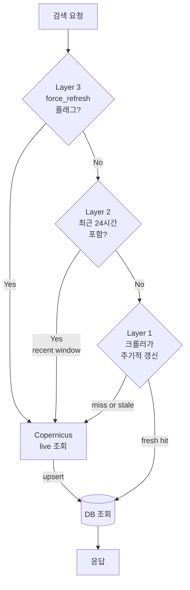

# 03. 메타데이터 동기화 전략

## 핵심 문제

사용자가 "지금 막 촬영된 scene"을 검색했을 때 놓치지 않도록 하는 것. DB 캐시만 믿으면 최악의 경우 **크롤링 간격만큼의 gap**이 발생한다.

해결책은 **3개 레이어**를 겹친다.

## 3-레이어 방어



### Layer 1: 주기적 크롤러 (4시간)

- 정의된 AOI(한반도 등)에 대해 최근 7일치 메타데이터 수집
- **파일은 받지 않음**, 메타데이터만
- `sentinel_scenes`에 upsert, `metadata_sync_log`에 기록
- 평상시 99% 트래픽은 이 덕분에 DB만 조회하면 됨

### Layer 2: 라이브 패스스루 (최근 24시간)

- 사용자 검색 기간이 **현재 시각 ± 24시간**을 포함하면 Copernicus 동기 호출
- 크롤러가 놓친 gap을 실시간으로 메움
- 과거 데이터만 검색하면 이 경로 타지 않음

### Layer 3: 명시적 리프레시

- 프론트에서 `?force_refresh=true`
- 사용자가 "확실히 최신 보고 싶다"고 할 때 쓰는 탈출구
- 쿼터 적용 (남용 방지)

## 캐시 히트 판정

"이 검색을 DB만으로 처리해도 되는가?"의 판단 로직:

```typescript
// apps/api/src/scenes/cache-policy.service.ts
@Injectable()
export class CachePolicyService {
  constructor(
    @InjectRepository(MetadataSyncLog)
    private readonly syncLogRepo: Repository<MetadataSyncLog>,
  ) {}

  async shouldUseCache(params: SearchParams): Promise<boolean> {
    const now = new Date();
    const recentWindow = new Date(now.getTime() - 24 * 60 * 60 * 1000);

    // Layer 2: 최근 24시간 포함 시 항상 live
    if (params.dateTo > recentWindow) {
      return false;
    }

    // Layer 1: 최근 7일 내 동일/상위 영역을 sync한 이력?
    const result = await this.syncLogRepo.query(
      `
      SELECT 1 FROM metadata_sync_log
      WHERE ST_Contains(bbox, ST_MakeEnvelope($1, $2, $3, $4, 4326))
        AND mission = $5
        AND synced_at > now() - interval '7 days'
        AND date_from <= $6 AND date_to >= $7
      LIMIT 1
      `,
      [
        params.bbox[0], params.bbox[1], params.bbox[2], params.bbox[3],
        params.mission,
        params.dateFrom, params.dateTo,
      ],
    );

    return result.length > 0;
  }
}
```

**`ST_Contains` 판정 이유**: 사용자가 "서울시"를 (126.8, 37.4, 127.2, 37.7)로 보내고, 크롤러는 한반도 전체(124, 33, 132, 39)를 조회했다면, 한반도가 서울시를 **포함**하므로 캐시 히트.

## Crawler 구현 (NestJS)

### 스케줄링 — `@nestjs/schedule`

```typescript
// apps/crawler/src/crawl/crawler.service.ts
import { Injectable, Logger } from '@nestjs/common';
import { Cron, CronExpression } from '@nestjs/schedule';

@Injectable()
export class CrawlerService {
  private readonly logger = new Logger(CrawlerService.name);
  private running = false;

  constructor(
    private readonly copernicus: CopernicusService,
    private readonly targetRepo: CrawlTargetRepository,
    private readonly sceneRepo: SentinelSceneRepository,
    private readonly syncLogRepo: MetadataSyncLogRepository,
  ) {}

  @Cron(CronExpression.EVERY_4_HOURS)
  async crawlCycle() {
    if (this.running) {
      this.logger.warn('Previous crawl still running, skipping');
      return;
    }
    this.running = true;

    try {
      const targets = await this.targetRepo.findEnabled();
      for (const target of targets) {
        await this.crawlTarget(target);
      }
    } finally {
      this.running = false;
    }
  }

  private async crawlTarget(target: CrawlTarget) {
    const dateFrom = target.lastCrawledAt
      ? new Date(target.lastCrawledAt.getTime() - 60 * 60 * 1000)
      : new Date(Date.now() - target.lookbackDays * 24 * 60 * 60 * 1000);
    const dateTo = new Date();

    for (const mission of target.missions) {
      try {
        const scenes = await this.copernicus.search({
          footprint: target.geom,
          dateFrom,
          dateTo,
          mission,
        });

        for (const scene of scenes) {
          await this.sceneRepo.upsert(scene);
        }

        await this.syncLogRepo.save({
          targetId: target.id,
          bbox: target.geom,
          dateFrom,
          dateTo,
          mission,
          sceneCount: scenes.length,
        });
      } catch (err) {
        this.logger.error(
          `Failed to crawl ${target.name} / ${mission}`,
          err.stack,
        );
      }
    }

    await this.targetRepo.update(target.id, { lastCrawledAt: new Date() });
  }
}
```

### 모듈 설정

```typescript
// apps/crawler/src/crawler.module.ts
import { Module } from '@nestjs/common';
import { ScheduleModule } from '@nestjs/schedule';

@Module({
  imports: [
    ScheduleModule.forRoot(),
    DatabaseModule,
    CopernicusModule,
  ],
  providers: [CrawlerService],
})
export class CrawlerModule {}
```

**주의**: `@nestjs/schedule`의 Cron은 **단일 프로세스 내**에서만 동작. 여러 인스턴스 띄우면 중복 실행됨. 크롤러는 반드시 **단일 인스턴스**로 배포하거나, DB advisory lock으로 leader 선출.

### DB advisory lock 기반 leader election (HA 필요 시)

```typescript
@Cron(CronExpression.EVERY_4_HOURS)
async crawlCycle() {
  const lockAcquired = await this.tryAdvisoryLock();
  if (!lockAcquired) {
    this.logger.debug('Another crawler holds the lock, skipping');
    return;
  }
  try {
    // ... crawl logic
  } finally {
    await this.releaseAdvisoryLock();
  }
}

private async tryAdvisoryLock(): Promise<boolean> {
  const result = await this.dataSource.query(
    `SELECT pg_try_advisory_lock(42) AS locked`,
  );
  return result[0].locked;
}
```

### Upsert 패턴

TypeORM의 `upsert()` 또는 QueryBuilder `orUpdate()` 사용 ([02-database-schema.md](./02-database-schema.md) 참조). 재처리 baseline 비교 조건은 raw SQL로 추가:

```typescript
await this.dataSource.query(
  `
  INSERT INTO sentinel_scenes (
    product_id, mission, product_type, sensing_start, sensing_end,
    footprint, processing_baseline, metadata, updated_at
  )
  VALUES ($1, $2, $3, $4, $5, ST_MakeValid($6::geometry), $7, $8, now())
  ON CONFLICT (product_id) DO UPDATE SET
    processing_baseline = EXCLUDED.processing_baseline,
    metadata = EXCLUDED.metadata,
    sensing_end = EXCLUDED.sensing_end,
    updated_at = now()
  WHERE sentinel_scenes.processing_baseline IS DISTINCT FROM EXCLUDED.processing_baseline
  `,
  [productId, mission, productType, start, end, footprintWkt, baseline, metadata],
);
```

재처리된 scene만 갱신.

## Copernicus API 래퍼

`libs/copernicus/src/copernicus.service.ts`로 구현, 모든 앱에서 공유.

### OAuth 토큰 관리

CDSE는 OAuth2, access token 만료 **600초(10분)**. 갱신 자동화 + 동시 갱신 방지 필수.

> **Legacy 참조**: `sar-data-retrieval/apps/sentinel-retrieval/src/infrastructure/clients/cdse/cdse-auth.service.ts`에서 검증된 패턴. [12-legacy-reference.md](./12-legacy-reference.md) 참고.

**중요**:
- `grant_type=password` + `client_id=cdse-public` 조합만 **다운로드가 가능**. `client_credentials`는 카탈로그 조회만 가능하고 파일 다운로드 시 401
- Content-Type은 **반드시 `application/x-www-form-urlencoded`** (JSON 불가)
- 만료 60초 전에 선제 갱신
- `refreshPromise`로 동시 갱신 중복 요청 제거

```typescript
// libs/copernicus/src/copernicus-auth.service.ts
import { Injectable, Logger, UnauthorizedException } from '@nestjs/common';
import { HttpService } from '@nestjs/axios';
import { ConfigService } from '@nestjs/config';
import { firstValueFrom } from 'rxjs';

@Injectable()
export class CopernicusAuthService {
    private readonly logger = new Logger(CopernicusAuthService.name);
    private accessToken: string | null = null;
    private tokenExpiresAt = 0;
    private refreshPromise: Promise<string> | null = null;

    constructor(
        private readonly http: HttpService,
        private readonly config: ConfigService,
    ) {}

    async 액세스토큰을_가져온다(): Promise<string> {
        const now = Date.now();
        if (this.accessToken && this.tokenExpiresAt > now + 60_000) {
            return this.accessToken;
        }
        if (this.refreshPromise) {
            return this.refreshPromise;
        }
        this.refreshPromise = this.토큰을_발급한다().finally(() => {
            this.refreshPromise = null;
        });
        return this.refreshPromise;
    }

    토큰을_무효화한다(): void {
        this.accessToken = null;
        this.tokenExpiresAt = 0;
    }

    private async 토큰을_발급한다(): Promise<string> {
        const params = new URLSearchParams({
            grant_type: 'password',
            client_id: this.config.get<string>('COPERNICUS_CLIENT_ID')!,
            username: this.config.get<string>('COPERNICUS_USERNAME')!,
            password: this.config.get<string>('COPERNICUS_PASSWORD')!,
        });

        const resp = await firstValueFrom(
            this.http.post(
                this.config.get<string>('COPERNICUS_AUTH_URL')!,
                params,
                { headers: { 'Content-Type': 'application/x-www-form-urlencoded' } },
            ),
        );

        this.accessToken = resp.data.access_token;
        this.tokenExpiresAt = Date.now() + resp.data.expires_in * 1000;
        this.logger.log('CDSE 액세스 토큰 갱신 완료');
        return this.accessToken;
    }
}
```

**401 재시도 패턴** (다운로드 서비스에서):

```typescript
try {
    const token = await this.authService.액세스토큰을_가져온다();
    return await this.다운로드한다(url, token);
} catch (err) {
    if (err.response?.status === 401) {
        this.authService.토큰을_무효화한다();
        const newToken = await this.authService.액세스토큰을_가져온다();
        return this.다운로드한다(url, newToken);  // 1회만 재시도
    }
    throw err;
}
```

### Rate limit 대응 & 페이지네이션

CDSE OData 제한:
- `$top` 최대 **1,000건/페이지**
- `$skip` 최대 **10,000** → 한 쿼리로 **최대 11,000건**만 조회 가능
- 이를 넘으면 날짜 범위를 쪼개 여러 쿼리로 분할

**동시성**: Copernicus는 다운로드에 대해 동시 연결 **4개** 권장. 검색 API는 5~10개 무방하지만 보수적으로 동일 풀 사용.

```typescript
// libs/copernicus/src/copernicus-search.service.ts
import pLimit from 'p-limit';

@Injectable()
export class CopernicusSearchService {
    private readonly concurrencyLimit = pLimit(5);

    constructor(
        private readonly auth: CopernicusAuthService,
        private readonly http: HttpService,
        private readonly config: ConfigService,
    ) {}

    async 씬을_검색한다(params: SearchParams): Promise<SceneMetadata[]> {
        return this.concurrencyLimit(() => this.검색을_수행한다(params));
    }

    private async 검색을_수행한다(params: SearchParams): Promise<SceneMetadata[]> {
        const baseUrl = this.config.get<string>('COPERNICUS_BASE_URL');
        const token = await this.auth.액세스토큰을_가져온다();
        const filter = this.필터를_생성한다(params);

        const PAGE_SIZE = 1000;
        const MAX_SKIP = 10000;
        const results: SceneMetadata[] = [];
        let skip = 0;

        while (skip <= MAX_SKIP) {
            const resp = await firstValueFrom(
                this.http.get(`${baseUrl}/odata/v1/Products`, {
                    headers: { Authorization: `Bearer ${token}` },
                    params: {
                        $filter: filter,
                        $top: PAGE_SIZE,
                        $skip: skip,
                        $orderby: 'ContentDate/Start desc',
                        ...(skip === 0 && { $count: true }),
                    },
                }),
            );

            const batch = resp.data.value as CdseProduct[];
            results.push(...batch.map(p => this.엔티티로_변환한다(p)));

            if (batch.length < PAGE_SIZE) break;
            if (results.length >= (params.limit ?? Infinity)) break;
            skip += PAGE_SIZE;
        }

        if (skip > MAX_SKIP) {
            this.logger.warn(
                `CDSE $skip 한계(10000) 도달 — 날짜 범위를 분할해 재실행 필요. params=${JSON.stringify(params)}`,
            );
        }

        return results;
    }

    /**
     * OData $filter 생성.
     * 주의: SRID=4326 필수, 좌표 순서는 (경도, 위도), 폐곡선이어야 함.
     */
    private 필터를_생성한다(params: SearchParams): string {
        const filters: string[] = [`Collection/Name eq '${params.mission}'`];

        if (params.productType) {
            filters.push(`contains(Name,'${params.productType}')`);
        }
        filters.push(`ContentDate/Start ge ${params.dateFrom.toISOString()}`);
        filters.push(`ContentDate/Start le ${params.dateTo.toISOString()}`);

        if (params.bbox) {
            const [minx, miny, maxx, maxy] = params.bbox;
            const polygon =
                `POLYGON((${minx} ${miny}, ${maxx} ${miny}, ${maxx} ${maxy}, ${minx} ${maxy}, ${minx} ${miny}))`;
            filters.push(
                `OData.CSC.Intersects(area=geography'SRID=4326;${polygon}')`,
            );
        }

        return filters.join(' and ');
    }
}
```

### OData 검색 함정 (Legacy 학습)

- **`GeoFootprint` 필드로 검색 금지** — 400 에러. `OData.CSC.Intersects(area=...)`만 유효
- **`SRID=4326` 명시 필수** — 생략 시 좌표계 오류
- **좌표 순서: (경도, 위도)** — GIS 업계 표준이지만 실수 쉬움
- **폴리곤은 폐곡선** — 시작점과 끝점이 같아야 함
- **Content-Type: `application/x-www-form-urlencoded`** (토큰 발급 시)
- **$skip 10,000 한계** — 날짜 범위로 분할하거나 좀 더 좁은 bbox 사용

### 모듈 등록

```typescript
// libs/copernicus/src/copernicus.module.ts
@Module({
  imports: [HttpModule, ConfigModule],
  providers: [CopernicusAuthService, CopernicusService],
  exports: [CopernicusService],
})
export class CopernicusModule {}
```

## 모니터링 지표

크롤러 운영 시 반드시 관찰할 것:

- **크롤링 주기 준수율**: 마지막 `last_crawled_at`이 너무 오래됐으면 알람
- **per-cycle 수집 scene 수**: 0이면 의심 (보통 한반도 4시간 기준 S1 1~4건, S2 계절별)
- **Copernicus API 에러율**: 급증 시 일시적 장애 or 인증 만료
- **upsert에서 실제 변경된 row 수**: 재처리율 추적
- **DB 캐시 히트율**: `should_use_cache`가 True 반환한 비율. 낮으면 크롤링 범위 확장 고려

## FAQ

**Q. 크롤링 주기를 1시간으로 줄이면 안 되나?**  
A. 가능하지만 이득이 적다. Sentinel 재방문 주기상 한반도 신규 scene은 하루 4~10건 수준. 4시간이면 충분하고, Layer 2가 gap을 메워준다. API 부하만 4배가 된다.

**Q. AOI 외 지역 검색은?**  
A. Layer 1 캐시가 없으므로 자동으로 Layer 2 (live)로 fallback. 첫 조회는 느리지만 DB에 캐싱되어 이후 요청은 빠름.

**Q. sync_log가 무한 증가하지 않나?**  
A. 30일 이상 된 로그는 주기적으로 삭제하는 cleanup 잡 필요. 캐시 히트 판정은 7일 이내만 보므로 오래된 로그는 의미 없음.
