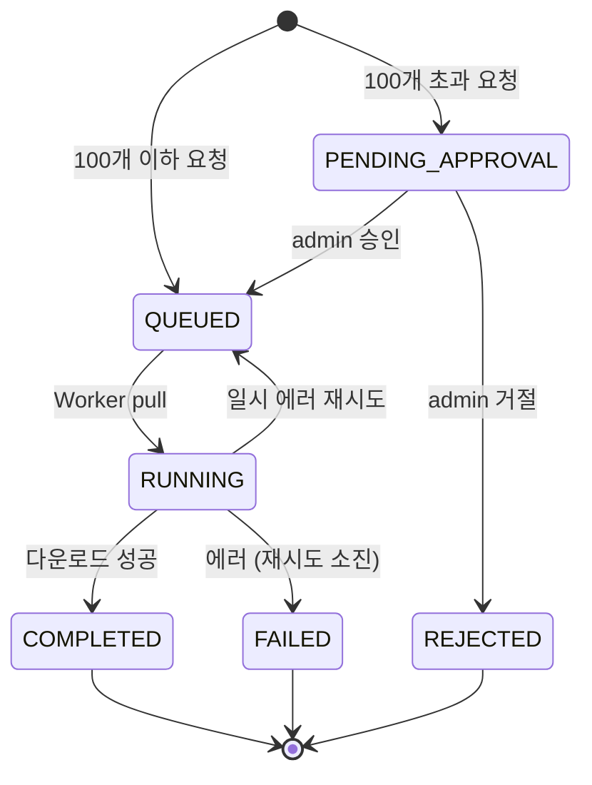
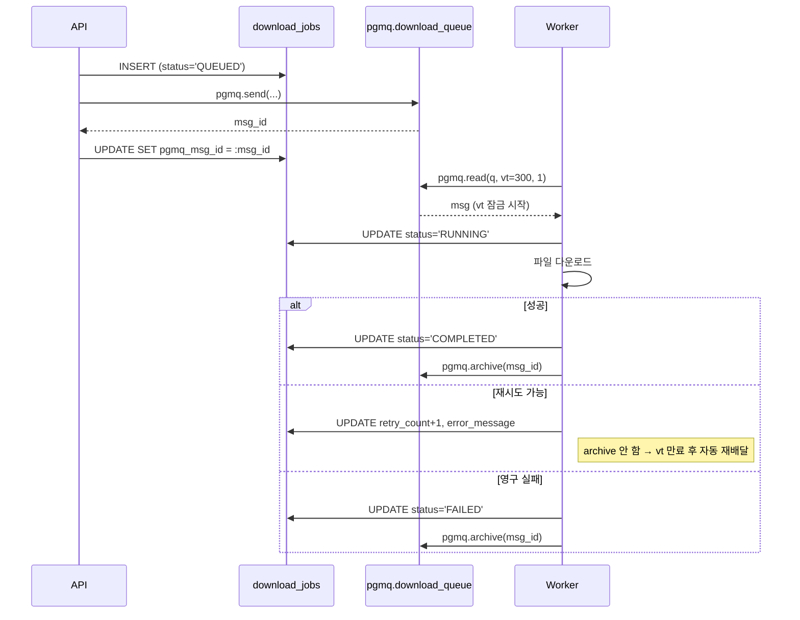

# 04. 다운로드 워크플로우

## 기본 원칙

- **검색과 다운로드는 분리된 엔드포인트**
- API 서버는 잡을 큐에 넣기만 하고 즉시 응답
- 실제 다운로드는 Worker가 비동기 처리
- 완료 시 알림

## 잡 상태 머신



## pgmq 기반 잡 큐

### 왜 pgmq인가

- 이미 PostGIS로 PG 의존성 있음 → Redis/RabbitMQ 추가하지 않음
- `SKIP LOCKED` 수동 구현 대비 **visibility timeout**, **archive 테이블**, **read_ct** 기본 제공
- 워커가 중간에 죽어도 `vt` 만료 후 메시지 자동 재배달 → 크래시 리커버리 로직 불필요
- PostgreSQL extension(`CREATE EXTENSION pgmq`)으로 설치, 의존성 추가 비용 최소

### 테이블과 큐의 역할 분담

- **`pgmq.download_queue`**: 워커 pull 채널. 메시지 본문은 `{"job_id": "..."}` 최소 정보만
- **`download_jobs` 테이블**: 비즈니스 상태. 승인 플로우, 진행률, 구독자, 감사



### Worker의 pull 패턴

```typescript
// apps/worker/src/download/job-queue.repository.ts
import { Injectable } from '@nestjs/common';
import { DataSource } from 'typeorm';

const QUEUE_NAME = 'download_queue';
const VISIBILITY_TIMEOUT_SEC = 300;

export interface PulledMessage {
  jobId: string;
  msgId: number;
  readCt: number;
}

@Injectable()
export class JobQueueRepository {
  constructor(private readonly dataSource: DataSource) {}

  async pull(): Promise<PulledMessage | null> {
    const rows = await this.dataSource.query(
      `SELECT msg_id, read_ct, message
         FROM pgmq.read($1, $2, $3)`,
      [QUEUE_NAME, VISIBILITY_TIMEOUT_SEC, 1],
    );
    if (rows.length === 0) return null;
    return {
      jobId: rows[0].message.job_id,
      msgId: Number(rows[0].msg_id),
      readCt: rows[0].read_ct,
    };
  }

  async archive(msgId: number): Promise<void> {
    await this.dataSource.query(
      `SELECT pgmq.archive($1, $2::bigint)`,
      [QUEUE_NAME, msgId],
    );
  }

  async enqueue(jobId: string): Promise<number> {
    const rows = await this.dataSource.query(
      `SELECT pgmq.send($1, $2::jsonb) AS msg_id`,
      [QUEUE_NAME, JSON.stringify({ job_id: jobId })],
    );
    return Number(rows[0].msg_id);
  }

  /** 즉시 재시도(vt=0 세팅). 백오프 대기가 필요하면 호출하지 말고 자연 만료 기다림. */
  async retryNow(msgId: number): Promise<void> {
    await this.dataSource.query(
      `SELECT pgmq.set_vt($1, $2::bigint, 0)`,
      [QUEUE_NAME, msgId],
    );
  }
}
```

### read_ct 기반 영구 실패 판정

pgmq가 `read_ct`(메시지 읽힌 횟수)를 제공하므로 `retry_count`와 별개로 안전장치 가능:

```typescript
if (pulled.readCt > MAX_READ_COUNT) {
  await this.jobRepo.markFailed(pulled.jobId, 'Exceeded max read count');
  await this.queueRepo.archive(pulled.msgId);
  return;
}
```

### 동시성 및 확장

- Worker 인스턴스 N개 → pgmq가 자동 분배 (visibility timeout으로 격리)
- 단일 Worker 내에서는 `p-limit`로 동시 다운로드 제한
- **Copernicus rate limit을 넘지 않도록 전역 semaphore 필요**

## Worker 메인 루프

NestJS `OnModuleInit`로 부트스트랩 후 폴링 루프 시작.

```typescript
// apps/worker/src/download/download-worker.service.ts
import { Injectable, Logger, OnModuleInit, OnModuleDestroy } from '@nestjs/common';
import pLimit from 'p-limit';

const MAX_RETRY = 5;
const MAX_READ_COUNT = 10;
const IDLE_POLL_MS = 5000;

@Injectable()
export class DownloadWorkerService implements OnModuleInit, OnModuleDestroy {
  private readonly logger = new Logger(DownloadWorkerService.name);
  private readonly concurrency = pLimit(3);
  private shuttingDown = false;
  private loopPromise: Promise<void>;

  constructor(
    private readonly queueRepo: JobQueueRepository,
    private readonly jobRepo: DownloadJobRepository,
    private readonly downloader: SceneDownloaderService,
    private readonly notifications: NotificationsService,
    private readonly workerIdentity: WorkerIdentityService,   // worker_id 관리
  ) {}

  onModuleInit() {
    this.loopPromise = this.run();
  }

  async onModuleDestroy() {
    this.shuttingDown = true;
    await this.loopPromise;
  }

  async run() {
    this.logger.log('Download worker started');
    while (!this.shuttingDown) {
      const msg = await this.queueRepo.pull();
      if (!msg) {
        await this.sleep(IDLE_POLL_MS);
        continue;
      }

      // pgmq가 이미 vt 잠금을 걸어둠. fire-and-forget.
      this.concurrency(() => this.processMessage(msg)).catch((err) =>
        this.logger.error('Unhandled job error', err),
      );
    }
  }

  private async processMessage(msg: PulledMessage) {
    // 안전장치: 반복 실패 메시지는 영구 실패 처리
    if (msg.readCt > MAX_READ_COUNT) {
      await this.jobRepo.markFailed(msg.jobId, `Read count exceeded (${msg.readCt})`);
      await this.queueRepo.archive(msg.msgId);
      return;
    }

    const job = await this.jobRepo.markRunning(msg.jobId, this.workerIdentity.id);
    if (!job) {
      // 이미 다른 경로로 처리됐거나 REJECTED된 경우
      await this.queueRepo.archive(msg.msgId);
      return;
    }

    try {
      const scene = await this.downloader.fetchSceneMeta(job.sceneId);
      const nasPath = this.downloader.buildNasPath(scene);

      await this.downloader.downloadToNas(scene.productId, nasPath, (bytes, total) =>
        this.jobRepo.updateProgress(job.id, bytes, total),
      );
      await this.downloader.verifyChecksum(nasPath, scene.metadata.checksum);

      await this.jobRepo.markCompleted(job.id, nasPath);
      await this.notifications.notifyJobComplete(job.id, scene);
      await this.queueRepo.archive(msg.msgId);
    } catch (err) {
      if (isRetriable(err) && job.retryCount < MAX_RETRY) {
        await this.jobRepo.recordRetry(job.id, err.message);
        // archive 하지 않음 → vt 만료 후 자동 재배달
      } else {
        await this.jobRepo.markFailed(job.id, err.message);
        await this.notifications.notifyJobFailed(job.id, err);
        await this.queueRepo.archive(msg.msgId);
      }
    }
  }

  private sleep(ms: number) {
    return new Promise((r) => setTimeout(r, ms));
  }
}
```

**변경점 요약**:
- `jobRepo.pullNextJob()` → `queueRepo.pull()` (pgmq)
- 성공/영구실패 시 `pgmq.archive()` 호출. 재시도는 vt 만료에 맡김
- 진행률 콜백으로 `download_jobs.downloaded_bytes` 실시간 업데이트
- 완료/실패 알림은 `notifyJobComplete(jobId)` — 내부에서 `job_subscribers`를 조회해 구독자 전원에게 발송

### 부트스트랩

```typescript
// apps/worker/src/main.ts
async function bootstrap() {
  const app = await NestFactory.createApplicationContext(WorkerModule);
  app.enableShutdownHooks();  // SIGTERM 시 OnModuleDestroy 호출
  // OnModuleInit에서 자동으로 run() 시작됨
}
bootstrap();
```

`enableShutdownHooks()`로 graceful shutdown 보장. 쿠버네티스 등에서 SIGTERM 받으면 현재 처리 중인 job 마친 뒤 종료.

## NAS 저장 구조

> **Legacy 참조**: `sar-data-retrieval`의 `StoragePathService` 로직을 계승. [12-legacy-reference.md](./12-legacy-reference.md).

```
/nas/sentinel/
├── S1A/
│   ├── SLC/
│   │   └── 2026/
│   │       └── 04/
│   │           └── S1A_IW_SLC__1SDV_20260423T...SAFE/
│   │               ├── manifest.safe
│   │               ├── measurement/
│   │               ├── annotation/
│   │               └── preview/
│   └── GRD/
│       └── 2026/04/
├── S1C/
├── S2A/
│   └── L2A/
│       └── 2026/04/
└── S2B/
```

**경로 규칙** — `{mission}/{productType}/{YYYY}/{MM}/{SAFE_NAME}`:
- `mission`: 파일명 앞 3자 (`S1A`, `S1B`, `S1C`, `S2A`, `S2B`)
- `productType`: 파일명에 포함된 `SLC`, `GRD`, `RAW`, `L1C`, `L2A`
- `YYYY/MM`: `ContentDate/Start` 또는 파일명의 `YYYYMMDDTHHMMSS` 기준
- SAFE 폴더 구조 **그대로 보존** (측정 데이터/주석/프리뷰 분리)

**경로 생성 로직**:

```typescript
// libs/common/storage/storage-path.service.ts
@Injectable()
export class StoragePathService {
    constructor(private readonly config: ConfigService) {}

    씬_경로를_생성한다(scene: SentinelScene): string {
        const mission = this.미션을_추출한다(scene.productId);
        const productType = this.제품타입을_추출한다(scene.productId);
        const date = scene.sensingStart ?? this.파일명에서_날짜를_추출한다(scene.productId);
        const year = String(date.getUTCFullYear());
        const month = String(date.getUTCMonth() + 1).padStart(2, '0');
        const safeName = scene.productId.endsWith('.SAFE')
            ? scene.productId
            : `${scene.productId}.SAFE`;

        return join(
            this.config.get<string>('NAS_BASE_PATH')!,
            mission,
            productType,
            year,
            month,
            safeName,
        );
    }

    private 미션을_추출한다(productId: string): string {
        const upper = productId.toUpperCase();
        if (upper.startsWith('S1A_')) return 'S1A';
        if (upper.startsWith('S1B_')) return 'S1B';
        if (upper.startsWith('S1C_')) return 'S1C';
        if (upper.startsWith('S2A_')) return 'S2A';
        if (upper.startsWith('S2B_')) return 'S2B';
        throw new Error(`알 수 없는 미션: ${productId}`);
    }

    private 제품타입을_추출한다(productId: string): string {
        const upper = productId.toUpperCase();
        if (upper.includes('_SLC_')) return 'SLC';
        if (upper.includes('_GRD')) return 'GRD';
        if (upper.includes('_RAW_')) return 'RAW';
        if (upper.includes('_MSIL2A_')) return 'L2A';
        if (upper.includes('_MSIL1C_')) return 'L1C';
        throw new Error(`알 수 없는 제품 타입: ${productId}`);
    }
}
```

## 다운로드 경로 선택: OData vs S3

Copernicus는 **두 가지 다운로드 경로**를 제공한다.

### 1. OData `$value` 엔드포인트 (기본)

```
https://download.dataspace.copernicus.eu/odata/v1/Products({id})/$value
```
- ✅ 계정 하나로 바로 사용 (별도 자격증명 불필요)
- ✅ 동시 연결 4개까지 허용 (CDSE 정책)
- ❌ 개별 파일 재귀 탐색 방식은 느림 (SAFE가 수십~수백 파일)
- ❌ 대용량에는 비효율적

### 2. S3 직접 다운로드 (권장, 대용량일 때)

```
https://eodata.dataspace.copernicus.eu/{bucket}/{key}
```
- ✅ 훨씬 빠름 (S3 최적화 전송)
- ❌ **별도 S3 자격증명 발급 필요** (CDSE dashboard에서)
- ❌ OAuth token으로 접근하는 방식 (S3 keypair 아님) — 문서 확인 필요

**권장 전략**: Phase 5에서 OData `$value`로 구현, 성능 병목 시 Phase 9에서 S3로 교체.

## 세마포어: 동시 다운로드 제한

Copernicus 정책상 **계정당 동시 4개**. 워커 인스턴스가 N개면 **글로벌 세마포어**로 조정 필요 — 그러나 분산 세마포어는 복잡하므로 **워커별 상한 = 4 / 워커 수**로 운영.

```typescript
// libs/common/concurrency/semaphore.ts
// p-limit 기반 단순 래퍼. Copernicus semaphore는 이걸로 충분.
import pLimit from 'p-limit';

export class Semaphore {
    private readonly limit: ReturnType<typeof pLimit>;
    constructor(maxConcurrent: number) {
        this.limit = pLimit(maxConcurrent);
    }
    async run<T>(task: () => Promise<T>): Promise<T> {
        return this.limit(task);
    }
    get active(): number { return this.limit.activeCount; }
    get pending(): number { return this.limit.pendingCount; }
}
```

```typescript
// apps/worker/src/download-loop/copernicus-concurrency.provider.ts
export const CopernicusConcurrencyProvider = {
    provide: 'COPERNICUS_SEMAPHORE',
    useFactory: (config: ConfigService) =>
        new Semaphore(Number(config.get('COPERNICUS_CONCURRENCY') ?? 4)),
    inject: [ConfigService],
};
```

**원칙**:
- **단일 계정 운영** — 모든 워커 인스턴스를 합쳐 동시 다운로드 **4개 이하** (CDSE 정책)
- 워커가 N개로 확장되면 `COPERNICUS_CONCURRENCY = 4 / N` 으로 운영
- 세마포어는 **다운로드만** 통과. 검색 API는 별개로 `p-limit(5)`

## 동일 scene 중복 방지

사용자 A와 B가 거의 동시에 같은 scene 요청 시 — 스키마의 `uq_jobs_scene_active` partial unique index + `job_subscribers` 테이블로 해결.

```typescript
// apps/api/src/downloads/downloads.service.ts
async requestDownload(user: User, sceneId: string): Promise<DownloadJobResult> {
  return this.dataSource.transaction(async (manager) => {
    const existing = await manager
      .createQueryBuilder(DownloadJob, 'j')
      .where('j.sceneId = :sceneId', { sceneId })
      .andWhere('j.status IN (:...active)', {
        active: ['QUEUED', 'PENDING_APPROVAL', 'RUNNING'],
      })
      .getOne();

    if (existing) {
      // 기존 잡에 구독자 추가 (본인이 최초 요청자면 no-op)
      await manager.query(
        `INSERT INTO job_subscribers (job_id, user_id)
           VALUES ($1, $2) ON CONFLICT DO NOTHING`,
        [existing.id, user.id],
      );
      return { jobId: existing.id, status: existing.status, subscribed: true };
    }

    // 새 잡 생성 + pgmq 메시지 발송
    const job = await manager.save(DownloadJob, {
      sceneId,
      requestedBy: user.id,
      status: 'QUEUED',
    });

    // 본인도 구독자 테이블에 자동 등록 (알림 일괄 조회 편의)
    await manager.query(
      `INSERT INTO job_subscribers (job_id, user_id) VALUES ($1, $2)`,
      [job.id, user.id],
    );

    const msgId = await this.queueRepo.enqueue(job.id);
    await manager.update(DownloadJob, job.id, { pgmqMsgId: String(msgId) });

    return { jobId: job.id, status: 'QUEUED', subscribed: false };
  });
}
```

**경쟁 조건 방어**: `uq_jobs_scene_active` partial unique index로 동시 INSERT 중 하나가 반드시 실패 → 실패한 쪽은 catch에서 재조회 후 구독만 추가하는 retry 로직 필요.

```typescript
try {
  return await this.attemptInsert(...);
} catch (err) {
  if (isUniqueViolation(err, 'uq_jobs_scene_active')) {
    return this.attemptSubscribe(...);
  }
  throw err;
}
```

완료 시 `requested_by` + `job_subscribers` 전원에게 알림 발송.

## 재시도 정책

| 에러 유형 | 처리 |
|-----------|------|
| Network timeout | 재시도 (max 3회, 지수 백오프) |
| Copernicus 429/503 | 재시도 (max 5회, 긴 백오프) |
| Copernicus 401 | 토큰 갱신 후 재시도 |
| Copernicus 404 | FAILED (scene 삭제됨) |
| Checksum mismatch | 재시도 (max 2회) |
| Disk full | 알람 + FAILED |
| Scene not available | FAILED |

```typescript
// apps/worker/src/download/download-job.repository.ts
async recordRetry(jobId: string, errorMessage: string): Promise<void> {
  await this.repo.update(jobId, {
    status: 'QUEUED',
    retryCount: () => 'retry_count + 1',
    errorMessage,
    startedAt: null,
    workerId: null,
  });
  // pgmq.archive() 호출 안 함 → vt(5분) 만료 시 자동 재배달
}
```

**백오프 전략**:
- pgmq는 고정된 visibility timeout만 제공하므로, 지수 백오프가 필요하면 `pgmq.set_vt(queue, msg_id, delay_sec)`로 다음 가시 시각을 미룸:

```typescript
const backoffSec = Math.min(2 ** retryCount * 30, 600);
await this.dataSource.query(
  `SELECT pgmq.set_vt('download_queue', $1::bigint, $2)`,
  [msgId, backoffSec],
);
```

- Copernicus 429/503은 긴 백오프(최대 10분), network timeout은 짧은 백오프(30초~5분) 권장

## 부분 다운로드 재개

큰 파일(1GB+) 다운로드 중 연결 끊어질 때 대응. Axios는 스트리밍 지원이 약해서 `node:https` 또는 `undici` 권장.

```typescript
import { createWriteStream, existsSync, statSync, renameSync } from 'node:fs';
import { request } from 'undici';

async downloadToNas(productId: string, targetPath: string) {
  const tmpPath = `${targetPath}.partial`;
  const resumeByte = existsSync(tmpPath) ? statSync(tmpPath).size : 0;

  const token = await this.auth.getToken();
  const headers: Record<string, string> = {
    Authorization: `Bearer ${token}`,
  };
  if (resumeByte > 0) {
    headers.Range = `bytes=${resumeByte}-`;
  }

  const url = `https://download.dataspace.copernicus.eu/odata/v1/Products(${productId})/$value`;
  const { statusCode, body } = await request(url, { headers });

  if (statusCode !== 200 && statusCode !== 206) {
    throw new Error(`Download failed: HTTP ${statusCode}`);
  }

  const writer = createWriteStream(tmpPath, {
    flags: resumeByte > 0 ? 'a' : 'w',
  });

  await new Promise<void>((resolve, reject) => {
    body.pipe(writer);
    body.on('error', reject);
    writer.on('finish', resolve);
    writer.on('error', reject);
  });

  renameSync(tmpPath, targetPath);
}
```

## 알림 구현

### 이벤트 발생 (Worker)

```typescript
// libs/notifications/src/notifications.service.ts
@Injectable()
export class NotificationsService {
  constructor(
    @InjectRepository(Notification)
    private readonly repo: Repository<Notification>,
    private readonly dataSource: DataSource,
  ) {}

  async create(userId: string, type: string, payload: object) {
    const notification = await this.repo.save({
      userId,
      type,
      payload,
    });

    // PostgreSQL NOTIFY
    await this.dataSource.query(
      `NOTIFY new_notification, $1`,
      [JSON.stringify({ userId, notificationId: notification.id })],
    );

    return notification;
  }
}
```

### Dispatcher 수신 — LISTEN 전용 연결

TypeORM 연결을 pub/sub에 쓰면 커넥션 풀이 소진됨. **별도의 `pg` Client**로 LISTEN 전용 연결 유지:

```typescript
// apps/worker/src/notifications/dispatcher.service.ts
import { Injectable, OnModuleInit, OnModuleDestroy, Logger } from '@nestjs/common';
import { Client } from 'pg';

@Injectable()
export class NotificationDispatcher implements OnModuleInit, OnModuleDestroy {
  private readonly logger = new Logger(NotificationDispatcher.name);
  private client: Client;

  constructor(
    private readonly config: ConfigService,
    private readonly mailer: MailerService,
    private readonly wsGateway: NotificationsGateway,
  ) {}

  async onModuleInit() {
    this.client = new Client({
      connectionString: this.config.get('DATABASE_URL'),
    });
    await this.client.connect();
    await this.client.query('LISTEN new_notification');
    this.client.on('notification', (msg) => this.handle(msg));
  }

  async onModuleDestroy() {
    await this.client?.end();
  }

  private async handle(msg: { payload: string }) {
    const { userId, notificationId } = JSON.parse(msg.payload);
    // DB에서 알림 내용 가져와서 발송
    // - 이메일: this.mailer.sendMail(...)
    // - WebSocket: this.wsGateway.sendToUser(userId, ...)
  }
}
```

### WebSocket 게이트웨이

```typescript
// apps/api/src/notifications/notifications.gateway.ts
import { WebSocketGateway, WebSocketServer } from '@nestjs/websockets';
import { Server } from 'socket.io';
import { UseGuards } from '@nestjs/common';

@WebSocketGateway({ namespace: '/ws/notifications' })
@UseGuards(JwtWsGuard)
export class NotificationsGateway {
  @WebSocketServer() server: Server;

  sendToUser(userId: string, event: string, data: object) {
    this.server.to(`user:${userId}`).emit(event, data);
  }
}
```

## 우선순위

초기에는 FIFO로 충분. 나중에 필요하면:

```sql
ALTER TABLE download_jobs ADD COLUMN priority INT DEFAULT 5;
CREATE INDEX idx_jobs_priority ON download_jobs (status, priority DESC, created_at)
    WHERE status = 'QUEUED';
```

`ORDER BY priority DESC, created_at`으로 pull.

## 모니터링

- **큐 적체량**: `SELECT count(*) FROM download_jobs WHERE status='QUEUED'`
- **처리 속도**: 시간당 COMPLETED 수
- **평균 처리 시간**: `completed_at - started_at` 평균
- **실패율**: FAILED / (COMPLETED + FAILED)
- **재시도 히스토그램**: `retry_count` 분포
- **Worker heartbeat**: 별도 `worker_heartbeats` 테이블로 워커 상태 추적
