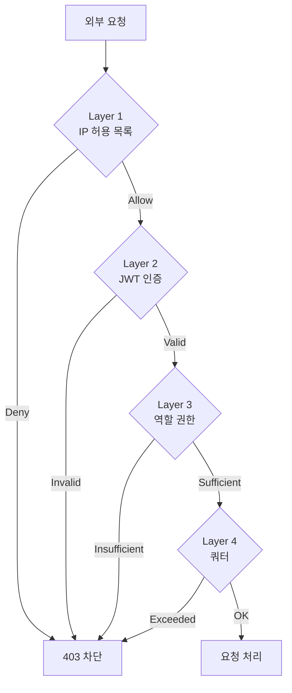
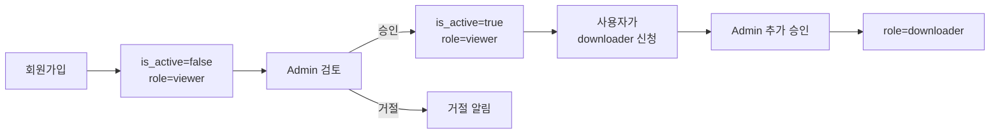

# 06. 인증 및 권한

## 2-Layer 방어



## Layer 1: IP Allowlist

### 구현 위치

- **Nginx/API Gateway 레벨** 권장 (애플리케이션 도달 전 차단)
- 또는 NestJS 미들웨어

### Nginx 예시

```nginx
geo $allowed_ip {
    default 0;
    10.0.0.0/8 1;       # 사내망
    192.168.0.0/16 1;   # VPN
    203.0.113.42/32 1;  # 특정 외부 IP
}

server {
    if ($allowed_ip = 0) {
        return 403;
    }
    location /api/ {
        proxy_pass http://backend;
    }
}
```

### DB 기반 동적 관리

NestJS 미들웨어로 구현. 캐싱은 `cache-manager`로.

```typescript
// apps/api/src/auth/ip-allowlist.middleware.ts
import { Injectable, NestMiddleware, ForbiddenException } from '@nestjs/common';
import { Request, Response, NextFunction } from 'express';
import { Inject } from '@nestjs/common';
import { CACHE_MANAGER } from '@nestjs/cache-manager';
import { Cache } from 'cache-manager';
import * as ipaddr from 'ipaddr.js';

@Injectable()
export class IpAllowlistMiddleware implements NestMiddleware {
  constructor(
    @Inject(CACHE_MANAGER) private readonly cache: Cache,
    private readonly dataSource: DataSource,
  ) {}

  async use(req: Request, res: Response, next: NextFunction) {
    const clientIp = this.extractIp(req);
    const allowed = await this.isAllowed(clientIp);

    if (!allowed) {
      throw new ForbiddenException({
        code: 'IP_BLOCKED',
        message: 'Access denied',
      });
    }
    next();
  }

  private async isAllowed(ip: string): Promise<boolean> {
    const cacheKey = 'ip_allowlist';
    let cidrs = await this.cache.get<string[]>(cacheKey);

    if (!cidrs) {
      const rows = await this.dataSource.query(
        `SELECT cidr::text FROM ip_allowlist WHERE enabled = true`,
      );
      cidrs = rows.map((r) => r.cidr);
      await this.cache.set(cacheKey, cidrs, 60_000);  // 60초 TTL
    }

    const addr = ipaddr.parse(ip);
    return cidrs.some((cidr) => {
      const [net, prefix] = ipaddr.parseCIDR(cidr);
      return addr.match(net, prefix);
    });
  }

  private extractIp(req: Request): string {
    // X-Forwarded-For 고려 (신뢰할 수 있는 프록시 뒤에서만)
    const forwarded = req.headers['x-forwarded-for'];
    if (forwarded) return (forwarded as string).split(',')[0].trim();
    return req.ip;
  }
}
```

AppModule에 등록:

```typescript
export class AppModule implements NestModule {
  configure(consumer: MiddlewareConsumer) {
    consumer.apply(IpAllowlistMiddleware).forRoutes('*');
  }
}
```

## Layer 2: JWT 인증

### 토큰 구조

```json
{
  "sub": "user-uuid",
  "email": "user@example.com",
  "role": "downloader",
  "iat": 1729670400,
  "exp": 1729674000
}
```

### 토큰 수명

- **Access token**: 1시간
- **Refresh token**: 30일 (DB에 저장, 재사용 감지 시 revoke)

### 구현 — `@nestjs/jwt` + `@nestjs/passport`

```bash
npm install @nestjs/jwt @nestjs/passport passport passport-jwt
```

**JwtStrategy**:

```typescript
// apps/api/src/auth/jwt.strategy.ts
import { Injectable, UnauthorizedException } from '@nestjs/common';
import { PassportStrategy } from '@nestjs/passport';
import { ExtractJwt, Strategy } from 'passport-jwt';

@Injectable()
export class JwtStrategy extends PassportStrategy(Strategy) {
  constructor(
    config: ConfigService,
    private readonly userRepo: UserRepository,
  ) {
    super({
      jwtFromRequest: ExtractJwt.fromAuthHeaderAsBearerToken(),
      secretOrKey: config.get('JWT_SECRET'),
      ignoreExpiration: false,
    });
  }

  async validate(payload: { sub: string; email: string; role: string }) {
    const user = await this.userRepo.findById(payload.sub);
    if (!user || !user.isActive) {
      throw new UnauthorizedException('User inactive');
    }
    return user;  // request.user로 접근 가능
  }
}
```

**AuthService**:

```typescript
// apps/api/src/auth/auth.service.ts
@Injectable()
export class AuthService {
  constructor(
    private readonly jwt: JwtService,
    private readonly userRepo: UserRepository,
  ) {}

  async login(email: string, password: string) {
    const user = await this.userRepo.findByEmail(email);
    if (!user || !(await bcrypt.compare(password, user.passwordHash))) {
      throw new UnauthorizedException('Invalid credentials');
    }
    if (!user.isActive) {
      throw new UnauthorizedException('Account not approved');
    }

    return {
      accessToken: this.jwt.sign(
        { sub: user.id, email: user.email, role: user.role },
        { expiresIn: '1h' },
      ),
      refreshToken: await this.createRefreshToken(user.id),
      expiresIn: 3600,
      user: { id: user.id, email: user.email, role: user.role },
    };
  }
}
```

**JwtAuthGuard 사용**:

```typescript
import { UseGuards } from '@nestjs/common';
import { AuthGuard } from '@nestjs/passport';

@Controller('scenes')
@UseGuards(AuthGuard('jwt'))
export class ScenesController {
  @Get()
  async search(@Req() req) {
    const user = req.user;  // JwtStrategy.validate()의 반환값
    // ...
  }
}
```

## Layer 3: 역할 기반 권한

### 역할 정의

| 역할 | 권한 |
|------|------|
| `viewer` | 검색, 메타데이터 조회, 자신의 잡 상태 조회 |
| `downloader` | viewer + 다운로드 요청 + 파일 접근 |
| `admin` | 전체 + 사용자 관리 + 승인 + 시스템 설정 |

### Roles 데코레이터 + Guard

```typescript
// libs/common/src/decorators/roles.decorator.ts
import { SetMetadata } from '@nestjs/common';
export const ROLES_KEY = 'roles';
export const Roles = (...roles: string[]) => SetMetadata(ROLES_KEY, roles);
```

```typescript
// apps/api/src/auth/roles.guard.ts
@Injectable()
export class RolesGuard implements CanActivate {
  constructor(private reflector: Reflector) {}

  canActivate(ctx: ExecutionContext): boolean {
    const required = this.reflector.getAllAndOverride<string[]>(ROLES_KEY, [
      ctx.getHandler(),
      ctx.getClass(),
    ]);
    if (!required) return true;

    const { user } = ctx.switchToHttp().getRequest();
    if (!required.includes(user.role)) {
      throw new ForbiddenException('Insufficient permissions');
    }
    return true;
  }
}
```

**사용**:

```typescript
@Controller('downloads')
@UseGuards(AuthGuard('jwt'), RolesGuard)
export class DownloadsController {
  @Post()
  @Roles('downloader', 'admin')
  async createDownload(@Body() dto: CreateDownloadDto, @Req() req) {
    // ...
  }
}
```

### 가입 플로우



## Layer 4: 쿼터

### 쿼터 정의

```typescript
// apps/api/src/auth/quota.constants.ts
export const QUOTA_DEFAULTS: Record<string, RoleQuota> = {
  viewer: {
    dailySceneCount: 0,
    dailyDownloadBytes: 0,
  },
  downloader: {
    dailySceneCount: 500,
    dailyDownloadBytes: 500 * 1024 ** 3,  // 500 GB/day
    concurrentJobs: 20,
  },
  admin: {
    dailySceneCount: 10_000,
    dailyDownloadBytes: 10 * 1024 ** 4,   // 10 TB/day
  },
};
```

### 체크 및 기록

```typescript
// apps/api/src/auth/quota.service.ts
@Injectable()
export class QuotaService {
  constructor(
    @InjectRepository(UserQuota)
    private readonly repo: Repository<UserQuota>,
  ) {}

  async check(user: User, sceneCount: number, estimatedBytes: number) {
    const quota = QUOTA_DEFAULTS[user.role];
    const today = new Date().toISOString().split('T')[0];

    const current = (await this.repo.findOne({
      where: { userId: user.id, period: today },
    })) ?? { sceneCount: 0, downloadedBytes: 0 };

    if (current.sceneCount + sceneCount > quota.dailySceneCount) {
      throw new QuotaExceededException('scene count');
    }
    if (current.downloadedBytes + estimatedBytes > quota.dailyDownloadBytes) {
      throw new QuotaExceededException('download bytes');
    }
  }

  async record(userId: string, sceneCount: number, bytesUsed: number) {
    const today = new Date().toISOString().split('T')[0];
    await this.repo
      .createQueryBuilder()
      .insert()
      .into(UserQuota)
      .values({ userId, period: today, sceneCount, downloadedBytes: bytesUsed })
      .orUpdate({
        conflict_target: ['user_id', 'period'],
        overwrite: ['scene_count', 'downloaded_bytes'],
      })
      .execute();
  }
}
```

## 요청당 상한 (100개 룰)

```typescript
// apps/api/src/downloads/downloads.service.ts
const MAX_SCENES_PER_REQUEST = 100;

@Injectable()
export class DownloadsService {
  constructor(
    private readonly jobRepo: JobRepository,
    private readonly quota: QuotaService,
    private readonly sceneRepo: SentinelSceneRepository,
    private readonly dataSource: DataSource,
  ) {}

  async createDownloadRequest(user: User, sceneIds: string[]) {
    const initialStatus: JobStatus =
      sceneIds.length > MAX_SCENES_PER_REQUEST ? 'PENDING_APPROVAL' : 'QUEUED';

    const scenes = await this.sceneRepo.findByIds(sceneIds);
    const estimatedTotalSize = scenes.reduce(
      (sum, s) => sum + (s.fileSizeBytes ?? 1_000_000_000),
      0,
    );

    await this.quota.check(user, sceneIds.length, estimatedTotalSize);

    await this.dataSource.transaction(async (manager) => {
      for (const sceneId of sceneIds) {
        await manager.insert(DownloadJob, {
          sceneId,
          userId: user.id,
          status: initialStatus,
        });
      }
    });

    if (initialStatus === 'PENDING_APPROVAL') {
      await this.notifyAdmins(user, sceneIds);
    }

    return { queued: sceneIds.length, status: initialStatus };
  }
}
```

## 감사 로그

모든 다운로드 요청은 `download_jobs.user_id`로 추적 가능. 추가로 API 레벨 audit log:

```sql
CREATE TABLE audit_log (
    id BIGSERIAL PRIMARY KEY,
    user_id UUID,
    ip_address INET,
    method TEXT,
    path TEXT,
    status_code INT,
    params JSONB,
    created_at TIMESTAMPTZ DEFAULT now()
);

CREATE INDEX idx_audit_user_time ON audit_log (user_id, created_at DESC);
```

NestJS Interceptor로 모든 요청 기록:

```typescript
// apps/api/src/common/audit.interceptor.ts
@Injectable()
export class AuditInterceptor implements NestInterceptor {
  constructor(private readonly auditRepo: AuditLogRepository) {}

  intercept(ctx: ExecutionContext, next: CallHandler): Observable<any> {
    const req = ctx.switchToHttp().getRequest();
    return next.handle().pipe(
      tap({
        next: (data) => this.record(req, ctx, 200),
        error: (err) => this.record(req, ctx, err.status ?? 500),
      }),
    );
  }

  private async record(req, ctx, statusCode: number) {
    await this.auditRepo.insert({
      userId: req.user?.id ?? null,
      ipAddress: req.ip,
      method: req.method,
      path: req.path,
      statusCode,
      params: { query: req.query, body: req.body },
    });
  }
}
```

권장: 최소 6개월 보관.

## 퇴사자 처리

```typescript
// apps/api/src/admin/users.service.ts
async deactivateUser(userId: string) {
  await this.dataSource.transaction(async (manager) => {
    await manager.update(User, userId, { isActive: false });
    await manager.delete(RefreshToken, { userId });
    await manager.update(
      DownloadJob,
      {
        userId,
        status: In(['QUEUED', 'PENDING_APPROVAL']),
      },
      {
        status: 'REJECTED',
        errorMessage: 'User deactivated',
      },
    );
  });
}
```

## 비밀번호 정책

- **bcrypt** 해싱 (cost factor 12)
- 최소 10자, 영문 + 숫자 + 특수문자 혼합
- 사내 SSO(SAML/OIDC) 연동도 고려 — 퇴사자 자동 차단 가능

## 개발/운영 분리

- 운영 환경 DB에는 test 계정 없음
- JWT SECRET은 환경별 분리, Vault/Secrets Manager 사용
- 개발 환경에서만 IP allowlist 비활성화 옵션
