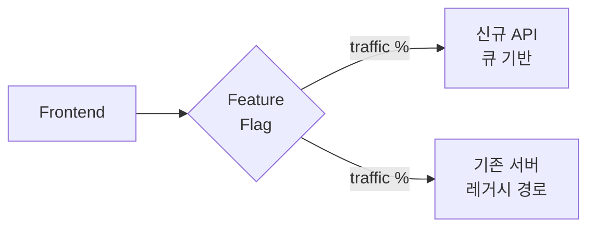

# 08. 구현 로드맵

## 현재 상태

- 기존에 데이터 retrieval 서버 존재 (로직 섞여 있음)
- NAS에 일부 Sentinel 데이터 이미 저장
- 행정구역 shapefile 보유

## 목표 상태

- API / Worker / Crawler 3개 컴포넌트로 분리
- PostgreSQL + PostGIS 기반 메타데이터 관리
- DB 기반 잡 큐
- 권한 및 쿼터 시스템
- 한국 행정구역 기반 검색 지원

## 단계별 마이그레이션

기존 서버를 한 번에 뜯지 말고 **점진적으로** 진행한다.

### Phase 0: 준비 (1주)

상세 셋업 절차는 **[09-setup.md](./09-setup.md)** 참조. 요약:

**인프라**:
- [ ] [09-setup.md](./09-setup.md)의 "Phase 0 완료 검증 체크리스트" 전 항목 통과
- [ ] Copernicus 계정 확인, API 호출 테스트

**DB 초기화**:
- [ ] TypeORM DataSource 설정
- [ ] [02-database-schema.md](./02-database-schema.md)의 모든 DDL을 마이그레이션 파일로 분할 작성
  - `001_CreateExtensions` — postgis, uuid-ossp, pgmq + `pgmq.create('download_queue')`
  - `002_CreateUsersAndAuth` — users, refresh_tokens, user_quotas, ip_allowlist, audit_log
  - `003_CreateScenes` — sentinel_scenes + GIST 인덱스
  - `004_CreateAdminRegions`
  - `005_CreateDownloadJobs` — download_jobs + partial unique index + job_subscribers
  - `006_CreateCrawlTargetsAndSyncLog`
  - `007_CreateNotifications` — notifications + worker_heartbeats
- [ ] 한국 행정구역 shapefile을 `admin_regions` 테이블에 적재 (`ogr2ogr`)

**기존 시스템 분석**:
- [ ] 기존 retrieval 서버의 현재 로직 파악 및 문서화
- [ ] 인터페이스 재현 테스트 작성 (동작 비교용)

**완료 기준**: [09-setup.md](./09-setup.md) 체크리스트 전 항목 + admin_regions 데이터 확인 + 기존 시스템 문서화 완료

### Phase 1: 메타데이터 기반 구축 (2주)

기존 NAS 파일 → DB에 메타데이터 등록.

- [ ] NAS 스캔 스크립트 작성 (`apps/crawler/src/scripts/import-nas.ts`): 기존 파일의 경로와 `product_id` 매핑
- [ ] `libs/copernicus`에 검색 클라이언트 최소 구현
- [ ] 각 `product_id`에 대해 Copernicus에서 메타데이터 가져와 `sentinel_scenes`에 INSERT
- [ ] `nas_path`, `download_status = 'READY'` 설정
- [ ] NestJS `CommandModule` 또는 npm script로 실행 가능하게
- [ ] 검증: 스캔한 파일 수 == DB의 `READY` 상태 scene 수

**완료 기준**: 기존 NAS 파일이 모두 DB에 인덱싱됨

### Phase 2: API 서버 최소 기능 (2주)

읽기 전용 API부터.

- [ ] `apps/api`에 `ScenesModule`, `RegionsModule`, `AuthModule` 생성
- [ ] `GET /scenes` 컨트롤러 (DB 조회만, live 없음)
- [ ] `GET /regions` 컨트롤러
- [ ] DTO + `class-validator`로 파라미터 검증
- [ ] `ValidationPipe` 전역 적용, 전역 예외 필터
- [ ] JWT 인증 (`@nestjs/jwt` + Passport JwtStrategy)
- [ ] `IpAllowlistMiddleware` 등록
- [ ] `AuditInterceptor` 적용
- [ ] Swagger 문서 자동 생성 (`@nestjs/swagger`)
- [ ] 단위 테스트 (Jest) + 통합 테스트 (Testcontainers로 PostGIS)

**완료 기준**: 프론트에서 bbox/region_code로 검색 가능, NAS 보유 여부 표시됨

### Phase 3: Crawler 분리 (1주)

- [ ] `libs/copernicus`에 `CopernicusAuthService` (OAuth 토큰 관리) 완성
- [ ] 재시도/rate limit 처리 (`p-limit`, 지수 백오프)
- [ ] `apps/crawler`에 `CrawlerService` 구현 (`@Cron(EVERY_4_HOURS)`)
- [ ] `crawl_targets`에 한반도 AOI 등록 (시드 마이그레이션)
- [ ] `metadata_sync_log` 기록
- [ ] Kubernetes 사용 시 단일 replica로 배포, 또는 advisory lock 구현
- [ ] 모니터링: `last_crawled_at` 노출 엔드포인트

**완료 기준**: 크롤러가 4시간마다 한반도 메타데이터를 DB에 upsert

### Phase 4: Live Passthrough 추가 (1주)

- [ ] `CachePolicyService` 구현 (최근 sync 확인)
- [ ] `ScenesService`에 캐시 히트 판정 로직 추가
- [ ] 최근 24시간 포함 시 Copernicus 동기 호출
- [ ] 응답 DTO에 `syncStatus` 필드 포함
- [ ] `?force_refresh=true` 쿼리 파라미터 지원
- [ ] Live 호출 경로 타임아웃 설정 (5~10초)

**완료 기준**: 최근 데이터 검색 시 Copernicus 호출되어 누락 없이 반환

### Phase 5: Download Worker 분리 (2주)

여기가 **기존 서버 로직과 가장 많이 얽히는 부분**.

- [ ] 기존 서버의 다운로드 로직을 재사용 가능한 함수/클래스로 추출
- [ ] `apps/worker`에 `DownloadWorkerService` 구현 (`OnModuleInit` 폴링 루프)
- [ ] `SceneDownloaderService`에 undici 기반 스트리밍, 부분 다운로드 재개, checksum 검증
- [ ] `apps/api`에 `POST /downloads` 컨트롤러 구현 (잡 INSERT)
- [ ] `setOnLocked('skip_locked')` 기반 pull
- [ ] `enableShutdownHooks()`로 graceful shutdown 보장
- [ ] 기존 다운로드 경로는 유지 (병행 운영)
- [ ] 신규 경로로 먼저 일부 사용자 트래픽 전환 (카나리)

**완료 기준**: 신규 경로로 다운로드 요청이 큐를 거쳐 처리됨. 기존 경로와 결과 동일

### Phase 6: 권한 및 쿼터 (1주)

- [ ] `JwtStrategy` + `RolesGuard` 완성
- [ ] `@Roles()` 데코레이터로 엔드포인트 보호
- [ ] 회원가입 → 관리자 승인 플로우 구현
- [ ] `QuotaService` 구현 + `POST /downloads`에 적용
- [ ] 100개 초과 시 `PENDING_APPROVAL` 상태 로직
- [ ] `apps/api/src/admin`에 관리자 API 구현
- [ ] Refresh token 처리 (`refresh_tokens` 테이블)

**완료 기준**: 권한 없는 사용자가 다운로드 시도 시 403, 쿼터 초과 시 429

### Phase 7: 알림 (1주)

- [ ] `libs/notifications`에 `NotificationsService` 구현
- [ ] `NOTIFY new_notification` 송신
- [ ] `NotificationDispatcher` — 별도 `pg` Client로 LISTEN 전용 연결
- [ ] 이메일: `@nestjs-modules/mailer` 통합 (SMTP 설정)
- [ ] WebSocket: `@nestjs/websockets` + socket.io로 `/ws/notifications` 게이트웨이
- [ ] WebSocket JWT 인증 Guard (`JwtWsGuard`)
- [ ] 실패 알림 포함
- [ ] 프론트에 연결 가이드 문서

**완료 기준**: 다운로드 완료 시 사용자가 이메일 또는 실시간 알림 수신

### Phase 8: 기존 서버 deprecate (1주)

- [ ] 모든 트래픽을 신규 경로로 전환
- [ ] 기존 서버 로직 제거 또는 재사용 모듈화 확정
- [ ] 레거시 엔드포인트 deprecation 공지
- [ ] 운영 문서 최종화

**완료 기준**: 기존 서버의 단일 프로세스가 API / Worker / Crawler 3개로 완전히 분리됨

### Phase 9: 운영 강화 (ongoing)

- [ ] NAS cleanup 잡
- [ ] 모니터링 대시보드
- [ ] 알람 규칙
- [ ] 백업/복구 테스트
- [ ] 성능 튜닝 (인덱스, 쿼리 최적화)
- [ ] 부하 테스트

## 병행 운영 전략

Phase 5~8은 리스크가 크므로 **신구 병행**:

- Feature flag로 사용자/요청별 라우팅
- 초기 10% → 50% → 100% 전환
- 문제 발견 시 즉시 롤백

## 의사결정 타이밍

아래 항목들은 **구현 진행하면서** 데이터 기반으로 결정:

- **크롤러 주기**: 4시간으로 시작, 수집 scene 수/API 부하 보고 조정
- **캐시 TTL**: 7일로 시작, 히트율 보고 조정
- **Worker 수**: 1개로 시작, 적체 상황 보고 증설
- **쿼터 수치**: 보수적으로 시작, 사용 패턴 보고 완화

## Phase별 완료 체크리스트

각 Phase 마지막에 다음 확인:

- [ ] 관련 문서 업데이트 (`docs/`)
- [ ] DB 마이그레이션 파일 커밋
- [ ] 테스트 통과 (단위 + 통합)
- [ ] staging 환경에서 1주 동작 확인
- [ ] 로그/모니터링 이상 없음
- [ ] 롤백 플랜 검증

## 리스크 및 대응

| 리스크 | 대응 |
|--------|------|
| Copernicus API 스펙 변경 | 래퍼 계층 격리, 통합 테스트 |
| NAS 용량 부족 | Phase 0부터 용량 모니터링, 7일 내 cleanup 구현 |
| 기존 서버 블랙박스 로직 | Phase 0에서 먼저 문서화, 재현 테스트 작성 |
| PostGIS 좌표계 실수 | 모든 geometry에 SRID 명시, 변환 시 로그 |
| Worker 다운로드 중단 | 부분 다운로드 재개, checksum 검증 |

## Claude Code 사용 팁

이 프로젝트에서 Claude Code로 작업할 때:

- 각 Phase를 별도 브랜치로 작업
- DB 스키마 변경은 TypeORM 마이그레이션 파일로 관리 (`synchronize: false`)
- Copernicus API 호출은 `HttpService` mock으로 테스트 가능하게 설계
- Copernicus 클라이언트는 [12-legacy-reference.md](./12-legacy-reference.md)의 이관 가이드를 따른다 (OAuth grant_type, $filter 함정 등)
- PostGIS 쿼리는 [11-index-strategy.md](./11-index-strategy.md)의 체크리스트대로 `EXPLAIN ANALYZE`로 검증
- 로컬 개발: `docker-compose up postgis`로 PostGIS 띄우고 `nest start api --watch`
- 테스트: 단위는 Jest, 통합은 Testcontainers로 실제 PostGIS 띄워서 검증
- Monorepo 빌드 시 `nest build api`, `nest build worker`, `nest build crawler` 각각 실행
- 공통 모듈 변경 시 영향 범위 확인: `libs/database` 수정 → 3개 앱 모두 재빌드

### 추천 pnpm scripts

[09-setup.md](./09-setup.md)의 `package.json` 섹션 참조.
